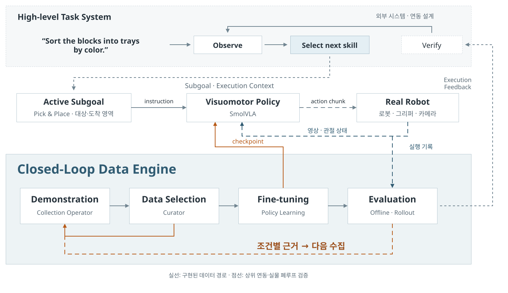
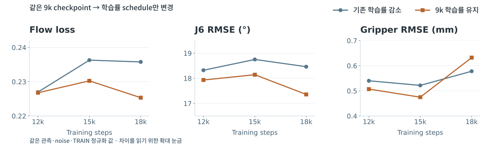

# Closed-Loop Data Engine for Robot Skill Adaptation

[한국어](README.md) · **English**

Developing a **physical robot data engine that connects demonstration collection, curation, policy training and evaluation back to the next collection plan**. On FAIRINO FR5, I implemented demonstration generation and recording across varied positions and orientations, connecting them to data curation, SmolVLA training and action comparison.

[Download presentation HTML](https://github.com/hasemu1211/fr5-lerobot-connector/releases/download/portfolio-2026-09-14/FR5-Portfolio.html) · [Viewing and building the presentation](docs/portfolio/README.md) · [Engineering decisions](docs/engineering-story.md)

The presentation and detailed technical documents are in Korean.

<!-- markdownlint-disable-next-line MD034 -- GitHub renders this attachment URL as a video player. -->
https://github.com/user-attachments/assets/ddaf0013-0103-4397-af53-d3b22047ffc1

Project overview · 90 seconds · English · From physical demonstrations to learning data and policy comparison

## Robot Skill Adaptation

The goal is to adapt robot skills to local task conditions by collecting demonstrations, training and evaluating policies, and adding the data they need. The implemented system supports collection, curation, training, offline comparison and proposals for further collection. Input, execution and result boundaries are also designed for integration with a higher-level task system.



[Architecture and integration points](docs/architecture.md)

## What I built

| Problem | Implementation |
| --- | --- |
| Workspace placements must become robot target poses | Register the workspace from physical reference points and cross-check the TCP. The current prototype generates an A4 board and JSON from the same definition. [Physical workspace registration](docs/data-factory.md#실물-좌표-등록과-보정) |
| Different objects require different positions, orientations and approaches | Combine object footprint, symmetry, grasp and approach profiles with the workspace to define demonstration conditions. Current physical examples are Pick and Pick & Place with a square object. [Collection design](docs/data-factory.md#위치와-각도-선택) |
| Preparing the next demonstration can contaminate the recorded task | Reposition the object outside the task-specific recording boundary. Bind source, destination and language instruction to the same task definition. [Task and recording boundaries](docs/portfolio/collection.html#recording-scope) |
| Cameras and robot signals arrive at different times | Align images, joint states and gripper commands to a shared training timestamp. [Temporal alignment](docs/dataset-quality.md#시간-정렬) |
| A correctly saved demonstration may still be unsuitable for training | Separate recording quality from content review, retaining source lineage and evaluation membership through selection and image transformation. [Data curation](docs/dataset-quality.md) |
| Changing data or training settings can change the comparison itself | Use TRAIN-only normalization and fixed evaluation observations to compare predicted joint and gripper actions. [Training and evaluation](docs/training-and-evaluation.md) |
| A disconnected interface or slow save should not trigger the same motion again | Separate motion completion from recording completion and prevent duplicate execution on reconnect or repeated requests. [Engineering decisions](docs/engineering-story.md) |

## Training and comparison

Fine-tuned SmolVLA on **40 bidirectional Pick & Place demonstrations, comprising 28,209 frames**, with 32 training and 8 evaluation episodes. Compared learning-rate schedules through 18,000 steps using the same evaluation observations and noise seeds.



[Comparison conditions and interpretation](docs/training-and-evaluation.md#pick--place--20260912)

## Next steps

Current collection proposals use coverage of successful demonstrations and human-reviewed policy execution segments. The next step is to **connect physical policy evaluation with targeted recollection and validate its effect**, comparing task success and actual collection cost for the same number of additional demonstrations. [Collection strategy and experiment plan](docs/portfolio/acquisition.html#study)

The longer-term direction is to extend this physical data engine into an online/offline data engine that links task conditions and evaluation evidence with simulation-based data generation and training, supporting robot foundation-model research and development.

<details>
<summary>Runtime and technical documentation</summary>

## Runtime

Robot operation targets Ubuntu 24.04, ROS 2 Jazzy, Python 3.12 and LeRobot 0.6.1. The presentation HTML opens in a browser without a robot or development environment.

After following [Getting started](docs/getting-started.md), open the operator interface with synthetic inputs:

```bash
direnv exec . python3 -m tools.data_factory.operator_console --effect-scope FAKE
```

For physical setup, execution and stopping procedures, use the [Operator runbook](docs/operator-runbook.md).

| Document | Contents |
| --- | --- |
| [Presentation guide](docs/portfolio/README.md) | Viewing and exporting the presentation |
| [Getting started](docs/getting-started.md) | Installation and first run without a robot |
| [System architecture](docs/architecture.md) | Data flow and module responsibilities |
| [Collection and execution contracts](docs/data-factory.md) | Condition design, execution and recording |
| [Dataset quality](docs/dataset-quality.md) | Alignment, quality checks, selection and transformation |
| [Training and evaluation](docs/training-and-evaluation.md) | Splits, training lineage and policy comparison |
| [Engineering decisions](docs/engineering-story.md) | Concrete problems and implementation choices |

## Foundations and license

The system uses LeRobot dataset and policy-training functionality, SmolVLA, ROS 2, MoveIt, the FAIRINO driver and Rerun. This repository contributes FR5 demonstration generation, recording, curation, policy comparison, execution integration and operator tooling.

Original code and documentation are licensed under [Apache License 2.0](LICENSE). External code and asset notices are preserved in [Third-party notices](THIRD_PARTY_NOTICES.md).

</details>
