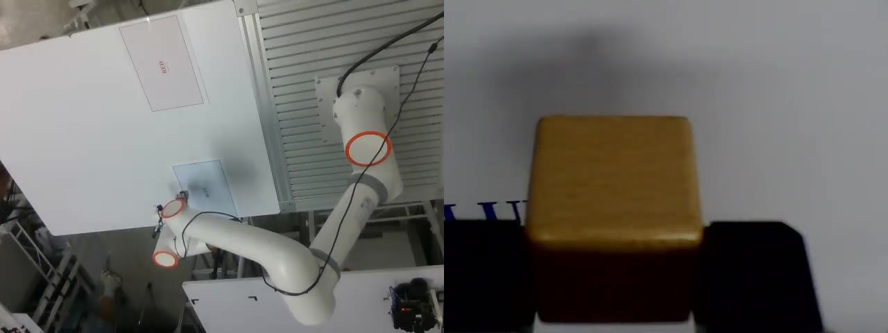
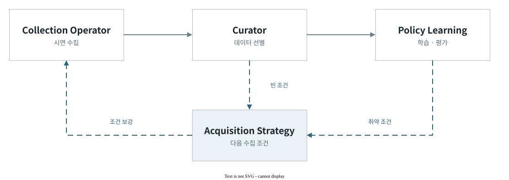

# Robot Learning Data Engine

로봇 데이터의 수집·선별·학습·평가를 연결하는 모방학습 데이터 엔진이다. 데이터와 정책 평가에서 찾은 부족한 조건을 다음 수집에 반영해, 정책 개선을 반복해서 검증하는 것이 목표이다. FAIRINO FR5를 구현·검증 플랫폼으로 사용한다.

**[포트폴리오 다운로드 · 38.2MB](https://github.com/hasemu1211/fr5-lerobot-connector/releases/download/portfolio-2026-09-08/FR5-Portfolio.html)** · [시스템 아키텍처](docs/architecture.md)

[](https://github.com/hasemu1211/fr5-lerobot-connector/releases/download/portfolio-2026-09-08/FR5-Portfolio.html)

**Pick & Place 시연 · 21.1초** — 같은 동작을 작업대와 그리퍼 시점에서 기록한다.

## 데이터에서 정책 비교까지



수집 조건에서 원본 시연, 데이터 선택과 checkpoint까지 출처를 연결한다. 같은 평가 데이터를 유지해 정책을 비교하고, 부족한 조건을 다음 수집의 가설로 만든다. 그림은 폐루프의 목표 구조이며 실물 정책 개선은 후속 검증 대상이다.

| 핵심 기능 | 설계 목적 |
| --- | --- |
| 동기 기록 | [영상·관절 상태·그리퍼 명령을 같은 시각의 학습 표본으로 정렬한다.](docs/dataset-quality.md#필수-자동-기준) |
| 데이터 선별 | [선택한 데이터의 원본과 학습·평가 배정을 유지해 데이터 변경의 영향을 비교한다.](docs/training-and-evaluation.md) |
| 정책 비교 | [같은 관측에서 생성한 동작을 관절·그리퍼 단위로 비교한다.](docs/training-and-evaluation.md#오프라인-평가) |

<details>
<summary>직접 실행하기 · 기술 문서 · 라이선스</summary>

## 실행 준비

**직접 실행할 때:** [시작하기](docs/getting-started.md)에서 환경을 준비한다. 다음 명령은 합성 입력으로 Collection 운영 화면을 열며 로봇·카메라·데이터셋을 사용하지 않는다.

```bash
direnv exec . python3 -m tools.data_factory.operator_console --effect-scope FAKE
```

실물 장비의 준비·실행·중단은 [운영자 런북](docs/operator-runbook.md)을 따른다.

## 문서

| 알고 싶은 것 | 문서 |
| --- | --- |
| 실제 화면·관측·수치로 프로젝트 살펴보기 | [포트폴리오 열람 안내](docs/portfolio/README.md) |
| 설치와 로봇 없는 첫 실행 | [시작하기](docs/getting-started.md) |
| 입력·출력·권한·산출물 소유권 | [데이터팩토리 계약](docs/data-factory.md) |
| 장비 준비·안전·중단·복구 | [운영자 런북](docs/operator-runbook.md) |
| 전체 데이터 흐름과 모듈별 책임 | [시스템 아키텍처](docs/architecture.md) |
| 저장 구조·시간 정합·품질 판정 | [데이터셋 품질](docs/dataset-quality.md) |
| policy 학습·checkpoint·오프라인 평가 | [학습과 평가](docs/training-and-evaluation.md) |
| 설계 선택과 검증 근거 | [설계 원리](docs/engineering-story.md) |

## 라이선스

직접 작성한 코드와 문서는 [Apache License 2.0](LICENSE)을 따른다. FAIRINO 하위 모듈과 DH-Robotics CAD mesh의 권리·고지는 [Third-party notices](THIRD_PARTY_NOTICES.md)에 보존한다.

</details>
