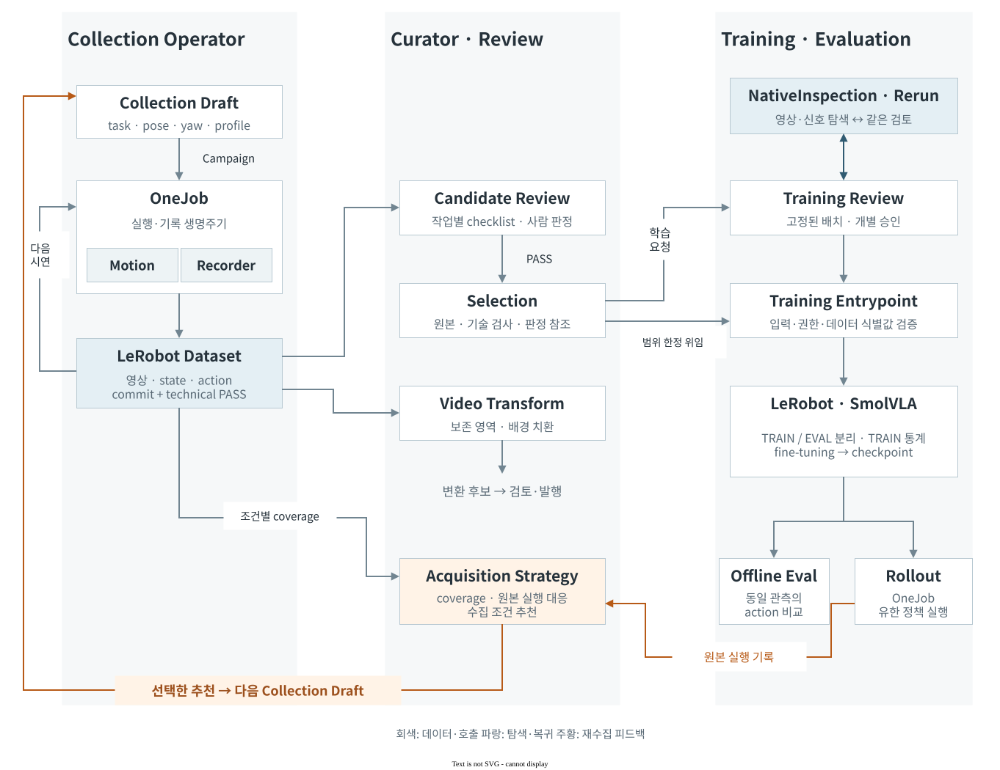
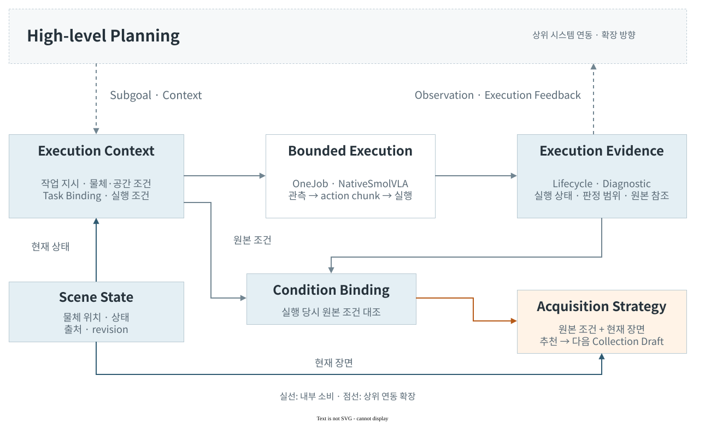
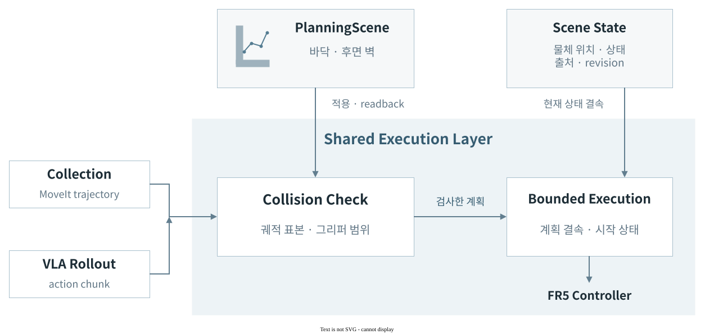

# 시스템 아키텍처

## Modules & Data Flow

[용어·연구 맥락](#task--skill--policy) · [구현 근거와 소비 조건](../tools/data_factory/)

## Task & Evidence Contracts

### Planning–Execution Interface

인터페이스 계약과 현재 소비자

| 계약 | 보존하는 정보 | 현재 소비자 |
| --- | --- | --- |
| [Scene State](../tools/data_factory/scene_state.py) | 현재 물체 위치·상태·출처·revision | Collection 계획·실행, 현재 장면의 수집 추천 |
| [Task Binding](../tools/data_factory/task_recipe.py) | task·공간 역할·workspace·pose | Collection 계획·실행, 기록 instruction |
| [NativeSmolVLA](../tools/data_factory/learned_action_adapter.py) | 언어 지시·RGB × 2·7D 상태 → action chunk | OneJob의 유한 정책 실행 |
| [Execution Diagnostic](../tools/data_factory/rollout/evidence_boundary.py) | checkpoint·실행 trace·사람 판정 범위 | Curator의 원본 실행 진단과 조건 대응 |
| [Collection Recommendation](../tools/data_factory/collection_recommendation.py) | 관측·제안·근거 참조·선택 변경 | CampaignOperator의 draft 갱신 |

[SceneStateStore](../tools/data_factory/scene_state.py)는 현재 물체 상태·위치·출처를 공유하고, 실행 시점의 원본 조건은 별도 근거로 보존한다. 현재 장면의 v2 추천과 기존 계획을 갱신하는 v1 경로는 [획득 전략](data-factory.md)에서 다룬다. [소비 경로 회귀](../tests/data_factory/test_collection_recommendation.py)는 원본 실행의 조건 대응과 추천 적용을 검증한다.

현재 입력은 Pick·Pick & Place의 작업·공간 계약이며, 실행 진단의 작업 전체 효과는 UNKNOWN으로 보존한다. 상위 planner·simulator가 이 결과를 소비하는 연동은 확장 방향이다.

## Scene & Execution

충돌 검사는 등록된 환경 형상과 궤적 표본을 기준으로 한다.

환경 형상·공통 검사·실행 결속

| 계약 | 실행에서 확인하는 대상 |
| --- | --- |
| [PlanningScene profile](../config/data_factory/planning_scenes/fr5-table-floor-wall-r003.json) | 바닥 높이·여유와 후면 벽 형상. 로봇 기준 좌표·workspace datum과 결속 |
| [SceneStateStore](../tools/data_factory/scene_state.py) | 물체 위치·상태·revision과 근거. 현재 실행 조건에 결속 |
| [RosMoveItTransport](../tools/data_factory/motion/moveit_transport.py) | 환경 apply/readback, 직렬화한 궤적의 관절·그리퍼 표본 유효성 |
| [PickupExecutor](../tools/data_factory/motion/pickup_executor.py) | 검사·승인한 계획 식별값, 시작 관측·장비·장면과 단일 실행 owner |

바닥·후면 벽은 현재 등록된 환경 장애물이다. 큐브의 위치 기록은 충돌 물체 등록이나 grasp attachment를 의미하지 않는다. 검사는 궤적 knot와 구간별 네 보간 표본을 사용하며, 연속 충돌 검증이나 미등록 물체와의 접촉 회피를 보장하지 않는다.

구현 근거: main `44b1ee1` · [Collection 회귀](../tests/data_factory/test_motion.py) · [학습 궤적 충돌 회귀](../tests/data_factory/rollout/test_finite_plan.py)

## Collection 실행 구조

Collection Operator는 계획한 위치·각도에 맞춰 시연 수집을 반복한다. OneJob은 한 시연의 동작과 중단을, Recorder는 학습할 구간의 기록과 저장을 맡는다.

준비 동작이 학습 목표에 섞이지 않도록 기록 구간을 나눈다.

실행 계획·모듈 책임·상태 계약

작업 조건을 작성하면 catalog의 호환 설정을 바탕으로 회차별 계획을 확정한다. 계획한 조건을 모두 수집하면 종료한다. 승인에는 계획 식별값과 유효기간이 연결된다. 브라우저는 서버의 현재 상태를 표시하고 명령을 전달하며, 로봇과 기록기의 상태는 서버가 관리한다. 계획 생성에는 로봇 동작이나 데이터 저장이 없다.

## 책임 표

| 구성요소 | 소유 | 소유하지 않음 |
| --- | --- | --- |
| catalog와 registry | 읽기 전용 적격화와 호환 조합 | qualification 승격, motion·dataset write |
| environment/setup | 장비 사실과 준비 결과 | planning, collection, semantic judgment |
| workflow application | draft, campaign 교체, finite operation | robot·recorder·dataset lifecycle |
| campaign authorization | digest·expiry로 묶은 finite envelope | semantic PASS, production admission, training approval |
| `OneJob`/executor | episode 단위 plan·실행·technical result | 최종 의미 판정 |
| episode ledger | provenance와 admission 기록 | Parquet/video row 삭제, training authority |
| operator UI | 하나의 view 렌더링과 허용된 intent 전송 | client state 저장, 숨은 재시도 |

이 경계는 [데이터팩토리 계약](data-factory.md)의 schema와 테스트가 뒷받침한다. UI의 dependency-free decision과 lifecycle 근거는 `operator-ui/architecture.md`에 보존된 accepted ADR에서 확인할 수 있다.

## 데이터와 상태

선택은 coherent catalog 조합으로 compile되고, manifest digest는 workspace/frame/task/object/grasp/start/motion/variant/camera/data mode와 finite slots를 결속한다. 변경된 draft는 이전 compile을 무효화하며 새 lineage가 필요하다. 실행 상태와 결과는 API projection과 run receipt로 확인한다.

technical result, human semantic state, retention state와 training state는 서로 다른 축이다. coverage projection은 TEST_ONLY 기록을 production coverage로 승격하지 않는다. 삭제나 repack은 reference scan과 별도 권한이 없으면 수행하지 않는다.

## 실패 시 경계

stale view, replay, digest mismatch, unknown enum, owner ambiguity, camera incompatibility, cancel, timeout과 expiry는 fail closed 한다. reconnect는 GET만 수행한다. foreground application이 종료되면 자신이 시작한 child만 닫으며, 이미 존재하는 다른 owner를 임의로 종료하지 않는다.

## 실행 자격

Catalog는 호환되는 조합을 제시하고, 실제 실행은 workspace·camera·task의 적격화와 해당 계획의 승인을 확인한다. 사람의 작업 성공 판정과 학습 사용 승인은 각 소비 단계에서 별도로 확인한다. 학습된 정책의 실행은 Collection의 시연 실행과 구분한다.

## Task · Skill · Policy

| 용어 | 이 프로젝트에서의 의미 | 구현 대응 |
| --- | --- | --- |
| Task | 달성할 목표. 상위 작업과 실행 단위 모두에서 사용한다. | Pick·Pick & Place의 recipe, 공간 역할, episode instruction |
| Subgoal | 현재 실행할 구체적인 목표 | 연동 시 수집 지시·기록 구간·학습 단위와 대응할 입력 |
| Skill | 여러 조건에서 작업을 수행하는 능력 | 실물 demonstration으로 적응시키려는 조작 능력 |
| Policy | 관측과 지시로 동작을 생성하는 모델 | SmolVLA의 language-conditioned action chunk |

상위 task planning은 작업 목표를 실행 skill의 선택·조합으로 구체화한다. 수집 recipe의 task는 Pick·Pick & Place라는 실행 단위의 지시이다. 아래 연구들은 상위 목표의 구체화와 하위 정책 실행을 분리한다. 입력 표현과 실행 판정 방식은 서로 다르다.

| 참고 연구 | 연결 경계 | 이 프로젝트에서 검토할 대응 |
| --- | --- | --- |
| [EmbodiedSkills](https://arxiv.org/html/2609.01281v1) | 실행 제안·조건 검사·유한 실행·결과 검증 | 작업 계약, OneJob, 원본 실행 진단 |
| [HiRoC](https://arxiv.org/html/2608.05999v1) | 언어 subgoal과 executor의 학습 분포 정렬 | 수집 instruction·기록 구간·정책 입력의 일치 |
| [VISTA](https://vista-wm.github.io/) | 언어와 목표 이미지로 GoalVLA 조건화 | 현재 언어·관측 계약에 목표 이미지 입력이 추가로 필요 |
| [Anticipation-VLA](https://arxiv.org/html/2605.01772v1) | 진행 판단에 따른 재귀적 subgoal 갱신 | 현재 실행 상태·사람 판정과 자동 progress 판정의 구분 |
| [Gemini Robotics ER 2](https://deepmind.google/models/gemini-robotics/embodied-reasoning/) | 작업 조율과 하위 VLA·로봇 API의 실행 | 상위 요청과 원본 실행 피드백의 연동 방향 |

현재 [NativeSmolVLA](../tools/data_factory/learned_action_adapter.py)는 언어 지시·두 카메라 영상·7차원 상태를 입력받는다. 상위 subgoal과 연동하려면 수집 지시·기록 구간·학습 단위가 같은 의미를 가져야 한다. 기존 작업·실행·진단 계약은 이 연동의 기반이며, 상위 planner 어댑터·목표 이미지 입력·자동 progress 판정은 확장 범위이다.

추가 배경: [SayCan](https://say-can.github.io/) · [Hi Robot](https://www.pi.website/research/hirobot) · [π0.5](https://www.pi.website/blog/pi05) · [SmolVLA](https://huggingface.co/blog/smolvla) · [Inner Monologue](https://innermonologue.github.io/)

## 관련 문서

[운영자 런북](operator-runbook.md)은 외부 효과와 중단을, [데이터셋 품질](dataset-quality.md)은 저장·검증을, [학습과 평가](training-and-evaluation.md)는 policy wrapper와 offline evaluation을 소유한다.
