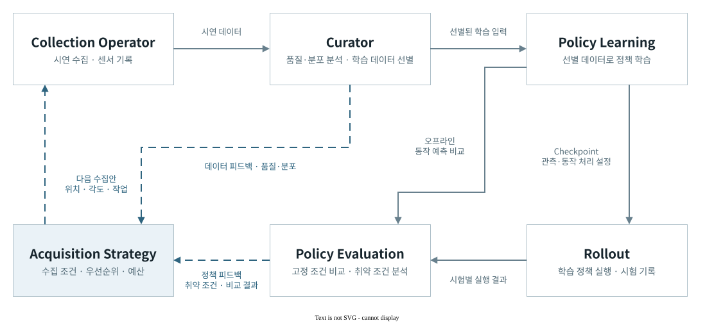
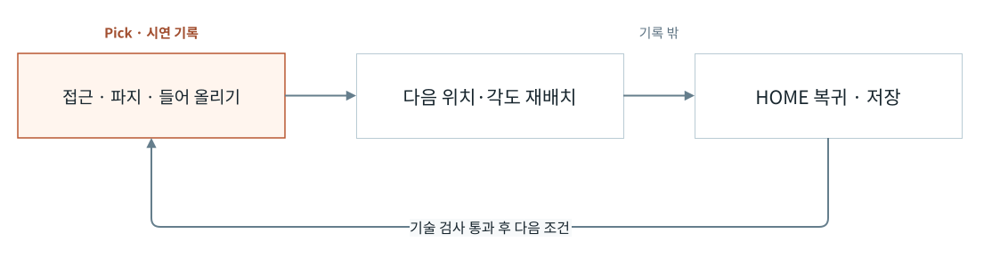

# 시스템 아키텍처

데이터와 정책 평가에서 찾은 부족한 조건을 다음 수집에 반영하는 폐루프 설계이다. FR5 시연 수집, 데이터 선별과 정책 비교를 같은 출처로 연결한다.

실선은 데이터 전달, 파란 점선은 다음 수집을 위한 피드백이다. 그림은 기능 책임을 기준으로 한 목표 구조이다.

| 구성 | 역할 |
| --- | --- |
| Collection Operator · Recorder | 작업 조건으로 시연을 실행하고 영상·상태·동작을 함께 기록한다. |
| Curator · Training Review | 시연의 품질과 분포를 검토하고 선택한 원본과 학습 입력의 대응을 유지한다. |
| Policy Learning | 승인된 데이터로 정책을 학습하고 같은 조건의 오프라인 결과를 비교한다. |
| Acquisition Strategy | 관측이 부족하거나 정책이 취약한 조건을 다음 수집 가설로 만든다. |

수집·기록·선별·학습·오프라인 비교와 조건별 수집 추천을 구현했다. 학습 정책의 실물 실행을 통한 재수집·재학습 효과는 검증할 다음 단계이다.

정책 실행의 소프트웨어 연결

학습 정책도 시연 수집과 같은 실행기와 기록기를 사용한다. [NativeSmolVLA](../tools/data_factory/learned_action_adapter.py)는 저장된 모델·전처리·정규화를 불러와 동작 묶음을 예측하고, [finite plan](../tools/data_factory/rollout/finite_plan.py)은 관측 시각·관절 단위·위치와 속도 조건을 확인한다.

[OneJob](../tools/data_factory/one_job.py)은 동작 묶음의 완료와 작업 전체의 완료를 구분한다. 묶음 끝에서 같은 기록기를 유지하고 다음 관측을 읽어, 실행을 조각별 데이터로 끊지 않도록 했다. [경계 회귀](../tests/data_factory/rollout/test_finite_plan.py)는 기록 유지와 관측 결속, 취소·만료·오래된 입력의 거절을 확인한다.

현재는 고정된 동작 묶음의 실행과 관측 경계를 연결한 소프트웨어 범위이다. 다음 예측의 계획·승인을 이어 작업 전체를 완료하는 경로와 실물 정책 성공은 별도 검증 대상이다.

## Collection 실행 구조

Collection Operator는 계획한 위치·각도에 맞춰 시연 수집을 반복한다. OneJob은 한 시연의 동작과 중단을, Recorder는 학습할 구간의 기록과 저장을 맡는다.

준비 동작이 학습 목표에 섞이지 않도록 기록 구간을 나눈다.

실행 계획·모듈 책임·상태 계약

작업 조건을 작성하면 catalog의 호환 설정을 바탕으로 회차별 계획을 확정한다. 계획한 조건을 모두 수집하면 종료한다. 승인에는 계획 식별값과 유효기간이 연결된다. 브라우저는 서버의 현재 상태를 표시하고 명령을 전달하며, 로봇과 기록기의 상태는 서버가 관리한다. 계획 생성에는 로봇 동작이나 데이터 저장이 없다.

## 책임 표

| 구성요소 | 소유 | 소유하지 않음 |
| --- | --- | --- |
| catalog와 registry | 읽기 전용 적격화와 호환 조합 | qualification 승격, motion·dataset write |
| environment/setup | 장비 사실과 준비 결과 | planning, collection, semantic judgment |
| workflow application | draft, campaign 교체, finite operation | robot·recorder·dataset lifecycle |
| campaign authorization | digest·expiry로 묶은 finite envelope | semantic PASS, production admission, training approval |
| `OneJob`/executor | episode 단위 plan·실행·technical result | 최종 의미 판정 |
| episode ledger | provenance와 admission 기록 | Parquet/video row 삭제, training authority |
| operator UI | 하나의 view 렌더링과 허용된 intent 전송 | client state 저장, 숨은 재시도 |

이 경계는 [데이터팩토리 계약](data-factory.md)의 schema와 테스트가 뒷받침한다. UI의 dependency-free decision과 lifecycle 근거는 `operator-ui/architecture.md`에 보존된 accepted ADR에서 확인할 수 있다.

## 데이터와 상태

선택은 coherent catalog 조합으로 compile되고, manifest digest는 workspace/frame/task/object/grasp/start/motion/variant/camera/data mode와 finite slots를 결속한다. 변경된 draft는 이전 compile을 무효화하며 새 lineage가 필요하다. 실행 상태와 결과는 API projection과 run receipt로 확인한다.

technical result, human semantic state, retention state와 training state는 서로 다른 축이다. coverage projection은 TEST_ONLY 기록을 production coverage로 승격하지 않는다. 삭제나 repack은 reference scan과 별도 권한이 없으면 수행하지 않는다.

## 실패 시 경계

stale view, replay, digest mismatch, unknown enum, owner ambiguity, camera incompatibility, cancel, timeout과 expiry는 fail closed 한다. reconnect는 GET만 수행한다. foreground application이 종료되면 자신이 시작한 child만 닫으며, 이미 존재하는 다른 owner를 임의로 종료하지 않는다.

## 실행 자격

Catalog는 호환되는 조합을 제시하고, 실제 실행은 workspace·camera·task의 적격화와 해당 계획의 승인을 확인한다. 사람의 작업 성공 판정과 학습 사용 승인은 각 소비 단계에서 별도로 확인한다. 학습된 정책의 실행은 Collection의 시연 실행과 구분한다.

## 관련 문서

[운영자 런북](operator-runbook.md)은 외부 효과와 중단을, [데이터셋 품질](dataset-quality.md)은 저장·검증을, [학습과 평가](training-and-evaluation.md)는 policy wrapper와 offline evaluation을 소유한다.
