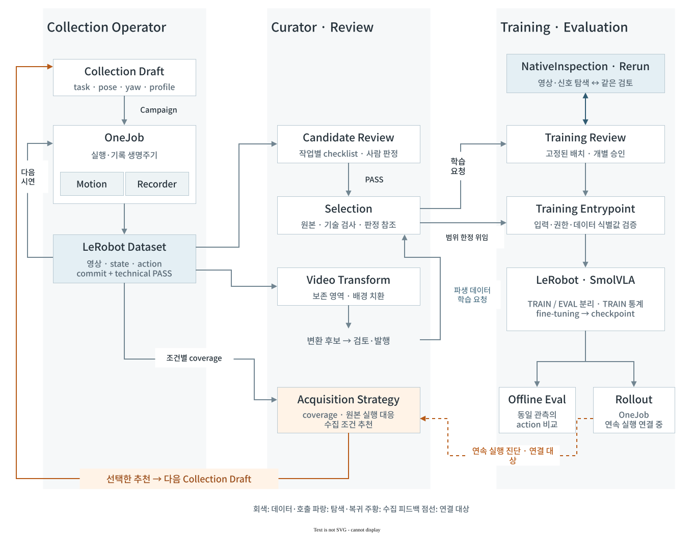
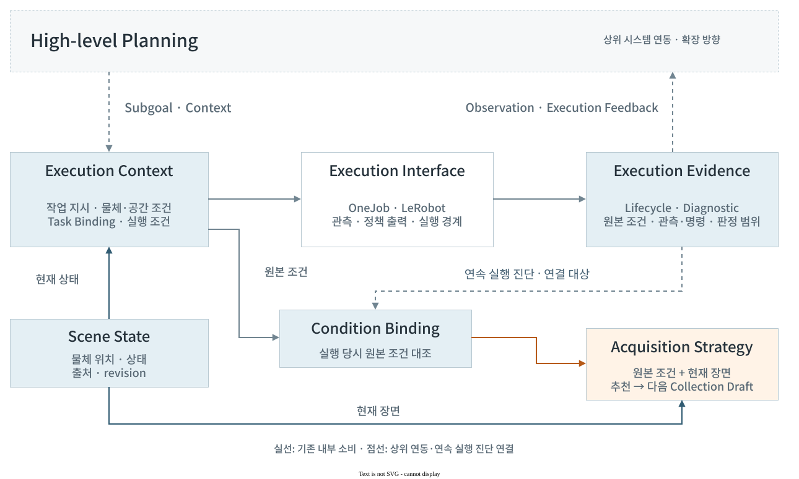
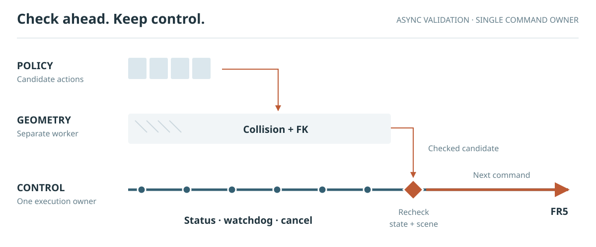
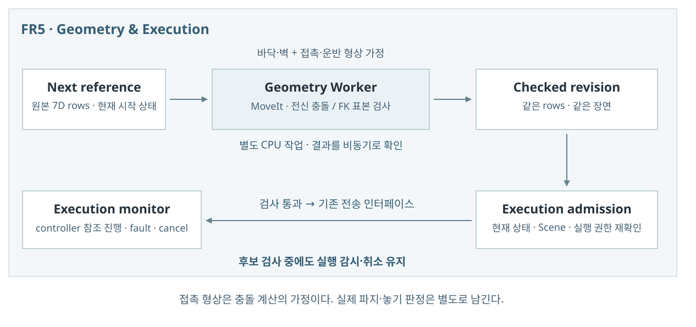
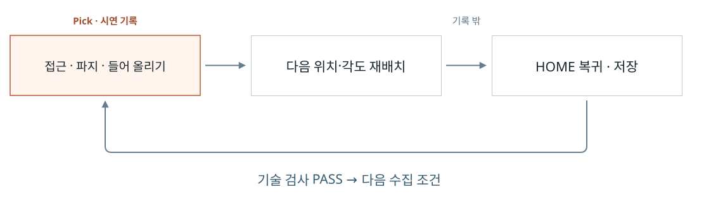

# 시스템 아키텍처

## 폐루프의 목적과 책임

**Closed-Loop Data Engine for Robot Skill Adaptation**은 작업 조건에 맞는 시연을 만들고, 선별·학습·평가 결과를 다음 데이터 선택으로 연결한다. 실패 조건의 재시연뿐 아니라 성공 시연의 반복·분포·관측 표현도 비교 대상이다.

우선 목표는 이 순환을 실물 로봇에서 완성하는 것이다. 이후에는 실물의 작업 조건과 평가 근거를 시뮬레이션의 데이터 생성·학습과 연결해, 로봇 파운데이션 모델 연구·개발에 쓰이는 온·오프라인 데이터 엔진으로 확장하고자 한다. 아래는 현재 실물 시스템의 설계와 구현을 설명한다.

| 기능 | 맡은 일 |
| --- | --- |
| Collection | 작업·물체·파지·접근 조건으로 시연을 계획하고 실행·기록하며 다음 배치를 관리 |
| Curator | 시연을 검토·선별하고 원본을 추적해 학습 요청과 다음 수집안을 구성 |
| Learning · Evaluation | 선택한 데이터로 정책을 학습하고 같은 입력 조건에서 동작을 비교 |
| Rollout | 정책의 동작을 로봇에 전달하고 관측·명령·중단 이유를 기록 |

수집 제안은 실행 명령이 아니다. `collection_recommendation.py`가 근거와 조건을 대응시키고, `operator/workflow/collection_advice.py`가 기존 수집 초안으로 연결한다. 실제 계획과 실행은 Collection의 기존 장면·장치·실행 계약을 따른다.

후속 실험 중 하나는 **추가 시연을 넓게 분산할 때와 취약 조건에 집중할 때 정책의 작업 결과가 어떻게 달라지는가**를 비교하는 것이다. 같은 수의 시연으로 비교하되 실제 수집·준비·복구 시간도 함께 확인한다. 수집 분포가 넓어졌다는 사실과 정책에 유용하다는 판단은 구분한다. 비교 조건은 [추가 수집 실험](portfolio/acquisition.html#study), 정책 지표는 [학습과 평가](training-and-evaluation.md#정책-비교와-실물-평가)가 설명한다.

## 모듈과 데이터 흐름

[용어·연구 맥락](#task--skill--policy) · [구현 근거와 소비 조건](../tools/data_factory/)

## 작업 조건과 실행 결과의 연결

### 계획과 실행 사이의 입력·출력

인터페이스 계약과 현재 소비자

| 계약 | 보존하는 정보 | 현재 소비자 |
| --- | --- | --- |
| [Scene State](../tools/data_factory/scene_state.py) | 현재 물체 위치·상태·출처·revision | Collection 계획·실행, 현재 장면의 수집 추천 |
| [Task Binding](../tools/data_factory/task_recipe.py) | task·공간 역할·workspace·pose | Collection 계획·실행, 기록 instruction |
| [NativeSmolVLA](../tools/data_factory/learned_action_adapter.py) | 언어 지시·RGB × 2·7D 상태 → action chunk | 기존 유한 실행·연속 실행 연결 중 |
| [Execution Diagnostic](../tools/data_factory/rollout/evidence_boundary.py) | checkpoint·실행 trace·사람 판정 범위 | Curator의 원본 실행 진단과 조건 대응 |
| [Collection Recommendation](../tools/data_factory/collection_recommendation.py) | 관측·제안·근거 참조·선택 변경 | CampaignOperator의 draft 갱신 |

[SceneStateStore](../tools/data_factory/scene_state.py)는 현재 물체 상태·위치·출처를 공유하고, 실행 시점의 원본 조건은 별도 근거로 보존한다. 현재 장면의 v2 추천과 기존 계획을 갱신하는 v1 경로는 [획득 전략](data-factory.md)에서 다룬다. [소비 경로 회귀](../tests/data_factory/test_collection_recommendation.py)는 원본 실행의 조건 대응과 추천 적용을 검증한다.

현재 입력은 Pick·Pick & Place의 작업·공간 계약이며, 실행 진단의 작업 전체 효과는 UNKNOWN으로 보존한다. 상위 planner·simulator가 이 결과를 소비하는 연동은 확장 방향이다.

## 장면 검사와 로봇 실행

LeRobot의 native async inference와 ActionQueue를 재사용한다. FR5는 원본 관측·예측 row 대응, 장면·상태 검사, ARM·그리퍼 전송과 취소를 맡는다. 연속 Rollout의 전체 공개 호출은 구현 중이며, 검사·전송 소유자 연결은 CPU geometry와 모의 actuator로 검증했다.

형상 검사와 명령 참조의 진행

Collection은 계획한 MoveIt 궤적을 검사한다. 연속 Rollout은 native 7D rows를 공통 시각의 ARM·그리퍼 참조로 구성한다. 별도 CPU helper가 전체 PlanningScene·로봇 모델로 충돌과 FK를 계산하는 동안 현재 동작의 감시·취소는 계속된다. 검사한 후보와 현재 상태·장면·권한이 일치해야 같은 실행 소유자가 전송한다.

바닥·벽·원래 물체 형상을 보존하고, 접촉·운반·놓기의 점유 공간을 계산 가정으로 추가한다. 이 형상 가정은 실제 파지 판정이나 Scene State 갱신 권한이 아니다. 충돌 표본 검증과 실물 접촉 성공은 별도이다.

ARM과 그리퍼의 명령 참조 진행을 함께 확인해 소비한 큐 prefix를 계산한다. 명령 접수는 소비나 작업 성공으로 취급하지 않는다. 현재 공개 호출의 producer→selection→commit→ACK 연결과 실물 연속 동작 검증은 남아 있다. 기존 유한 실행 진단과 새 stream 진단의 재수집 소비도 분리한다. 새 stream 진단을 이용한 표적 재수집은 아직 지원되지 않는다.

구현: [native queue adapter](https://github.com/hasemu1211/fr5-lerobot-connector/blob/816de823590ad1315c7a6d575713fe660d25a1a8/plugins/lerobot_strategy_fr5/src/lerobot_strategy_fr5/acknowledged_queue.py) · [실행 소유자](https://github.com/hasemu1211/fr5-lerobot-connector/blob/816de823590ad1315c7a6d575713fe660d25a1a8/tools/data_factory/motion/pickup_executor.py) · [비동기 geometry](https://github.com/hasemu1211/fr5-lerobot-connector/blob/816de823590ad1315c7a6d575713fe660d25a1a8/tools/data_factory/motion/native_geometry.py) · [현재 호출](https://github.com/hasemu1211/fr5-lerobot-connector/blob/816de823590ad1315c7a6d575713fe660d25a1a8/tools/data_factory/run_job.py)

정책 실행 기록의 해석 · 실물 시험과 진단 정정

2026-09-13 유한 실행 시험은 초기 ARM 2구간 완료 뒤 상태 검사에서 중단됐다. 이후 연속 실행 구조의 개발과 이 과거 실물 기록을 구분한다. 2026-09-16 정정에 따르면 실패한 시작 응답의 `execute_goal_count: 0`은 호출자의 상태 요약이며 보존된 로봇 전송 횟수 자체가 아니다. 응답 하나만으로 무전송을 확정하지 않는다. 기존 `LEARNED_STALE_STATE` 복구와 장면 상태는 실행 소유자가 확인한다. [실물 기록과 진단 발췌](portfolio/sources/motion.html#physical-attempt)

## Collection 실행 구조

Collection Operator는 계획한 위치·각도에 맞춰 시연 수집을 반복한다. OneJob은 한 시연의 동작과 중단을, Recorder는 학습할 구간의 기록과 저장을 맡는다.

준비 동작이 학습 목표에 섞이지 않도록 기록 구간을 나눈다.

실행 계획·모듈 책임·상태 계약

작업 조건을 작성하면 catalog의 호환 설정을 바탕으로 회차별 계획을 확정한다. 계획한 조건을 모두 수집하면 종료한다. 승인에는 계획 식별값과 유효기간이 연결된다. 브라우저는 서버의 현재 상태를 표시하고 명령을 전달하며, 로봇과 기록기의 상태는 서버가 관리한다. 계획 생성에는 로봇 동작이나 데이터 저장이 없다.

## 책임 표

| 구성요소 | 소유 | 소유하지 않음 |
| --- | --- | --- |
| catalog와 registry | 읽기 전용 적격화와 호환 조합 | qualification 승격, motion·dataset write |
| environment/setup | 장비 사실과 준비 결과 | planning, collection, semantic judgment |
| workflow application | draft, campaign 교체, finite operation | robot·recorder·dataset lifecycle |
| campaign authorization | digest·expiry로 묶은 finite envelope | semantic PASS, production admission, training approval |
| `OneJob`/executor | episode 단위 plan·실행·technical result | 최종 의미 판정 |
| episode ledger | provenance와 admission 기록 | Parquet/video row 삭제, training authority |
| operator UI | 하나의 view 렌더링과 허용된 intent 전송 | client state 저장, 숨은 재시도 |

입력·출력의 세부 규칙은 [시연 생성 설계](data-factory.md), 화면과 서버의 책임 분리는 [운영 UI 설계](../operator-ui/architecture.md)에서 설명한다.

## 데이터와 상태

사용자가 선택한 설정은 서로 호환되는지 검사한 뒤 실행 계획으로 만든다. 작업영역·좌표계·물체·파지·동작·카메라 설정과 회차별 조건을 계획의 해시에 묶어, 승인한 내용과 실제 실행할 내용이 같은지 확인한다. 초안을 바꾸면 이전 계획을 그대로 실행하지 않고 새로 생성한다.

저장 품질, 사람의 작업 판정, 데이터 보존 상태와 학습 사용 상태는 따로 관리한다. 시험용 기록은 실제 수집 실적에 섞지 않는다. 데이터를 삭제하거나 재구성할 때는 이를 참조하는 기록을 확인하고 별도 승인을 거친다.

## 실패 시 경계

화면이 오래됐거나 요청의 설정·해시·유효기간이 맞지 않으면 실행하지 않는다. 재접속은 서버 상태를 다시 조회하는 동작이며 새 수집 명령이 아니다. 애플리케이션을 종료할 때도 자신이 시작한 하위 프로세스만 정리해, 기존의 다른 실행기를 임의로 종료하지 않는다.

## 실행 자격

Catalog는 호환되는 조합을 제시하고, 실제 실행은 workspace·camera·task의 적격화와 해당 계획의 승인을 확인한다. 사람의 작업 성공 판정과 학습 사용 승인은 각 소비 단계에서 별도로 확인한다. 학습된 정책의 실행은 Collection의 시연 실행과 구분한다.

## Task · Skill · Policy

| 용어 | 이 프로젝트에서의 의미 | 구현 대응 |
| --- | --- | --- |
| Task | 달성할 목표. 상위 작업과 실행 단위 모두에서 사용한다. | Pick·Pick & Place의 recipe, 공간 역할, episode instruction |
| Subgoal | 현재 실행할 구체적인 목표 | 연동 시 수집 지시·기록 구간·학습 단위와 대응할 입력 |
| Skill | 여러 조건에서 작업을 수행하는 능력 | 실물 demonstration으로 적응시키려는 조작 능력 |
| Policy | 관측과 지시로 동작을 생성하는 모델 | SmolVLA의 language-conditioned action chunk |

상위 task planning은 작업 목표를 실행 skill의 선택·조합으로 구체화한다. 수집 recipe의 task는 Pick·Pick & Place라는 실행 단위의 지시이다. 아래 연구들은 상위 목표의 구체화와 하위 정책 실행을 분리한다. 입력 표현과 실행 판정 방식은 서로 다르다.

| 참고 연구 | 연결 경계 | 이 프로젝트에서 검토할 대응 |
| --- | --- | --- |
| [EmbodiedSkills](https://arxiv.org/html/2609.01281v1) | 실행 제안·조건 검사·유한 실행·결과 검증 | 작업 계약, OneJob, 원본 실행 진단 |
| [HiRoC](https://arxiv.org/html/2608.05999v1) | 언어 subgoal과 executor의 학습 분포 정렬 | 수집 instruction·기록 구간·정책 입력의 일치 |
| [VISTA](https://vista-wm.github.io/) | 언어와 목표 이미지로 GoalVLA 조건화 | 현재 언어·관측 계약에 목표 이미지 입력이 추가로 필요 |
| [Anticipation-VLA](https://arxiv.org/html/2605.01772v1) | 진행 판단에 따른 재귀적 subgoal 갱신 | 현재 실행 상태·사람 판정과 자동 progress 판정의 구분 |
| [Gemini Robotics ER 2](https://deepmind.google/models/gemini-robotics/embodied-reasoning/) | 작업 조율과 하위 VLA·로봇 API의 실행 | 상위 요청과 원본 실행 피드백의 연동 방향 |

현재 [NativeSmolVLA](../tools/data_factory/learned_action_adapter.py)는 언어 지시·두 카메라 영상·7차원 상태를 입력받는다. 상위 subgoal과 연동하려면 수집 지시·기록 구간·학습 단위가 같은 의미를 가져야 한다. 기존 작업·실행·진단 계약은 이 연동의 기반이며, 상위 planner 어댑터·목표 이미지 입력·자동 progress 판정은 확장 범위이다.

추가 배경: [SayCan](https://say-can.github.io/) · [Hi Robot](https://www.pi.website/research/hirobot) · [π0.5](https://www.pi.website/blog/pi05) · [SmolVLA](https://huggingface.co/blog/smolvla) · [Inner Monologue](https://innermonologue.github.io/)

## 관련 문서

[운영자 런북](operator-runbook.md)은 장비 준비·실행·중단 절차를, [데이터셋 품질](dataset-quality.md)은 기록 검사와 선별을, [학습과 평가](training-and-evaluation.md)는 학습 입력·정책 비교·실물 평가를 설명한다.
