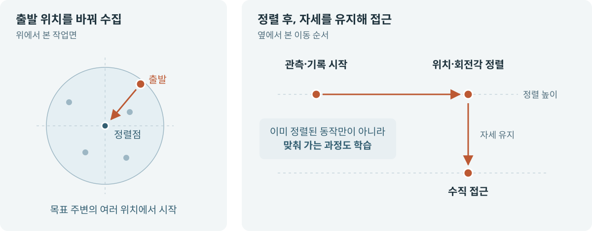
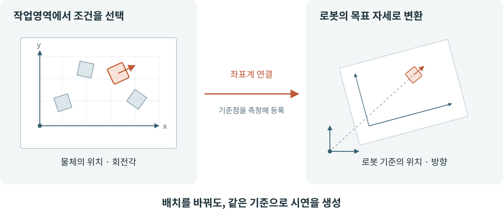
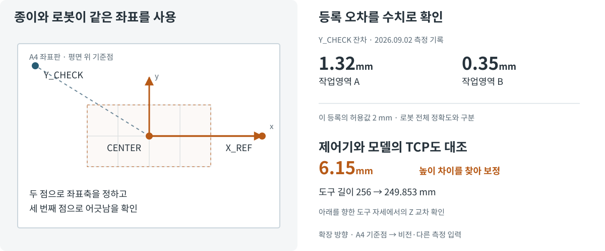
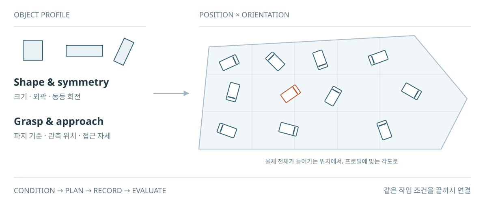

# 시연 생성과 다음 수집 설계

작업과 물체에 맞게 시연 조건을 설계하고 반복 수집한다. 물체·파지·접근 설정과 작업영역을 연결하고, 선택한 조건을 실행 계획과 저장 기록에 남긴다. 위치·각도를 바꾸는 수집은 현재 구현한 사례이며, 이 기록을 학습·평가와 다음 수집 선택으로 이어가는 것이 목적이다.

## 작업 조건 → 시연 데이터

| 단계 | 입력 | 남기는 결과 |
| --- | --- | --- |
| 수집 초안 작성 | 작업·물체·작업영역·현재 배치·동작 설정 | 수집 횟수와 위치·각도 조건 |
| 실행 계획 생성 | 등록된 설정과 수집 초안 | 조건별 실행 순서와 반복 횟수가 고정된 계획 |
| 시연 실행 | 승인한 계획 | 로봇 동작과 기록, 실행 당시 조건 |
| 저장·자동 검사 | 영상·상태·동작과 각각의 시각 | LeRobot 데이터셋과 저장 품질 판정 |

한 수집 계획에서는 시연을 하나씩 실행한다. 각 시연의 저장과 자동 검사가 끝나면 다음 조건으로 이어진다. 올바른 작업을 수행했는지 검토하고 학습에 사용할 데이터를 고르는 과정은 [수집 실행과 분리](architecture.md#modules--data-flow)되어 있다.

### 시연 조건과 접근 궤적

위치·각도를 분산해 시연을 만들고, 물체에 정렬하는 과정이 데이터에 담기도록 정렬 전 관측부터 기록한다.

[공간 표본화](../tools/data_factory/workspace_geometry.py) · [각도 배정](../tools/data_factory/state_space.py) · [접근 궤적](../tools/data_factory/motion/trajectory_variants.py)

## 작업영역과 시연 분포 설계

### 실물 좌표 등록과 보정

위치와 각도로 지정한 작업 조건을 로봇이 실행하려면, 작업영역과 로봇의 좌표 기준을 연결해야 한다. 현재는 A4 기준점을 측정해 이 변환을 등록한다. 인쇄물은 좌표계를 현장에 맞추기 위한 수단이며, 시연 생성은 등록된 좌표계와 물체·작업 설정을 사용한다.

등록 방식과 측정·보정 기록

[A4 좌표판 생성기](../tools/a4_place_yaw/README.md)는 인쇄물과 로봇이 읽는 JSON을 같은 정의에서 만든다. CENTER와 X_REF를 측정해 평면 좌표축을 만들고 Y_CHECK를 독립 확인점으로 사용한다. [좌표 변환과 등록 검사](../tools/fr5_data_factory.py)는 같은 보정·TCP·시트 계열을 확인한 뒤 위치와 yaw를 로봇 기준 좌표로 변환한다.

[2026-09-02 측정 기록](../config/data_factory/calibration_evidence/place-ab-controller-ui-r002.json)의 Y_CHECK 잔차는 A 1.323mm, B 0.354mm다. [A 등록 설정](../config/data_factory/cells/place-a-yaw0-r003.json)은 Y 확인점 잔차 2mm, 인쇄 길이 오차 1mm, X 기준점 거리 오차 2mm, 평면 이탈 0.1mm와 합산 오차 4mm의 서로 다른 검사를 둔다. 이는 해당 등록의 기준이며 로봇 전체의 위치 정확도를 뜻하지 않는다.

같은 기록에서 아래를 향한 도구 자세의 제어기 TCP와 ROS 모델을 대조해 Z 차이 6.147mm를 확인했고, 도구 길이를 256mm에서 249.853mm로 보정했다. 인쇄의 96→100mm 보정, 셀의 좌표 등록, TCP 보정과 실행 시 FK 검사는 서로 다른 문제를 다룬다. [측정값·보정 기준·실행 검사 상세](portfolio/sources/workspace-registration.html)

### 등록 영역에서 조건 생성

이 좌표계의 1차 목적은 알고리즘으로 시연 궤적을 생성하는 것이다. 동시에 작업 위치·각도·물체 조건을 명시해, 제한된 상태공간의 조건을 실물에서 반복하고 각 시연과 평가 기록에 같은 의미로 남긴다.

### 측정 입력의 확장

현재 프로토타입은 A4 기준점을 측정해 좌표를 등록한다. 이후에는 비전이나 다른 측정 장치가 위치·각도를 공급하도록 연결하고, 기존 작업 조건·시연·진단의 대응은 재사용하는 방향으로 확장할 수 있다. 센서 관측을 로봇 기준 좌표로 변환하고 측정 시각·대상 식별·불확실성을 확인하는 어댑터는 해당 확장에서 구현·검증할 부분이다.

[AprilTag](https://april.eecs.umich.edu/software/apriltag)는 카메라에 대한 태그의 위치·방향·식별을 제공하므로 작업면 기준점의 영상 기반 등록을 검토할 수 있다. [FoundationPose](https://nvlabs.github.io/FoundationPose/)는 CAD 또는 소수 참조 영상이 있는 새로운 물체의 6D 자세 추정·추적을 다뤄, 물체 자세 입력의 확장 후보가 된다. 두 방식은 각각 작업면 등록과 물체 추적이라는 다른 역할이다. 현재 구현의 성과는 측정 수단 자체보다 그 결과를 수집·학습·평가의 같은 조건으로 연결한 데 있다.

### 위치와 각도 선택

볼록 polygon으로 작업영역을 정의하고, 물체 외곽·경계 여유를 반영해 위치·yaw를 생성한다. 각 시연의 원본 조건과 판정을 보존해 같은 작업·물체·보정 조건의 수집량을 집계하고 다음 계획에 연결한다.

수집 조건은 한 물체에 고정하지 않는다. 물체의 크기·평면 대칭성, 파지 프로필, 각도 표본화와 접근 프로필을 연결해 조건을 구성한다. 같은 작업영역도 물체의 외곽과 회전각에 따라 배치 가능한 중심 영역이 달라진다. 새로운 조합의 실물 실행에는 해당 물체·파지·장면 설정의 확인이 필요하다.

물체별 회전 설정과 현재 정사각 물체의 사례

[각도 프로필 검사](../tools/data_factory/state_space.py)는 물체·파지 프로필과 평면 대칭 차수, 동등 회전 주기, 대표 각도 구간을 대조한다. 구간 폭은 동등 회전 주기와 같아야 하고, 대칭 차수와 주기의 곱은 360°여야 한다. 이 구조는 한 종류의 물체나 한 각도 범위로 고정되어 있지 않다.

현재 [24 mm 정사각 물체의 설정](../config/data_factory/yaw_sampling_profiles/wood-cube-24mm-top-r001.json)은 4회 대칭과 90° 주기를 사용해 −45° 이상 45° 미만에서 대표 각도를 표본화한다. 기존 그림의 화살표가 오른쪽 계열에 모였던 이유는 이 사례의 대표 각도를 그렸기 때문이다. 이동 방향이나 전체 시스템의 허용 방향을 뜻하지 않는다. 다른 물체의 대칭성·각도 설정과 실물 적격화는 별도로 관리한다.

설명용 기하·판정 예시

[기하·표본화와 연결 근거](portfolio/sources/collection-catalog.html#workspace-acquisition)

## Acquisition Strategy · 다음 수집 조건

| 추천 경로 | 사용하는 근거 | 제안의 의미 |
| --- | --- | --- |
| 현재 장면의 균형 수집 | 현재 물체·scene, 호환되는 성공 기록, 수집 예산 | 현재 출발 pose를 유지하며 위치·yaw를 분산 |
| 실행 조건의 재시연 | 원본 입력·계획과 사람의 실행 구간 실패 판정 | 해당 원본 조건을 다음 시연에 포함 |
| 기존 계획의 갱신 | 같은 campaign의 계획과 순서대로 저장된 기록 | 아직 관측하지 않은 조건의 첫 수집 |

첫 경로는 현재 장면에서 위치·각도를 분산하고, 두 번째는 과거 실행의 원본 조건을 다음 수집안에 포함한다. 마지막 경로는 기존 계획에서 아직 수집하지 않은 조건을 선택한다. 조건별 수집량은 관측 범위이며 정책에 얼마나 유용한지를 나타내는 점수는 아니다.

현재 장면의 추천 · 원본 실패 조건 · 적용과 재검증

[Collection Recommendation](../tools/data_factory/collection_recommendation.py)의 acquisition v2 경로는 현재 catalog·selection·scene·object instance·수집 수·seed·반복과 선택한 motion preset을 받는다. ledger와 DQA로 호환되는 기록을 확인하고, native sampler로 유한한 pose·yaw 조건을 만든다. 과거 campaign의 authoring을 복원해 현재 장면으로 대체하지 않는다.

Pick과 Pick & Place의 성공 coverage를 분리하고 현재 source pose를 첫 조건으로 보존한다. 선택한 적격 preset을 추천에 결속한다. 다른 recipe·속도의 기록은 이력으로 남으며 현재 실행 자격을 대신하지 않는다. 균형 표본화의 seed를 coverage에 맞춰 학습하거나 가장 부족한 조건을 최적화하는 기능은 아니다.

`HUMAN_REVIEWED_CHUNK_FAILURE`가 있으면 실행 진단과 preapproval의 원본 입력·계획을 대조해 source XY/yaw를 복원한다. 복구 뒤의 현재 pose는 별도로 유지한다. 균형 표본에 원본 조건이 없으면 native DIRECT authoring으로 포함하며, 현재 조건과 원본 조건을 함께 담을 예산이 없으면 거부한다. 과거 실패 기록을 이후 복구 성공으로 덮어쓰지 않는다. 이것은 사람이 검토한 실행 구간의 재시연 가설이며 자동 원인·phase 판정이나 실패 상태에서의 recovery action 생성은 아니다.

[Collection의 추천 선택](../tools/data_factory/operator/workflow/application.py)은 현재 초안에 결속된다. 적용과 [compile](../tools/data_factory/operator/composition.py)에서 원본 기록·scene·선택 설정을 다시 확인하고 생성된 pose·yaw·표본 조건을 추천과 대조한다. stale 추천과 사용자가 바꾼 직접 입력·고정 조건을 덮어쓰지 않는다. 추천은 motion·recorder·학습을 시작하거나 승인하지 않는다. 실제 재시연의 효과는 같은 추가 데이터·학습 예산의 [정책 비교](training-and-evaluation.md#정책-비교와-실물-평가)로 검증한다.

기존 campaign의 미관측 slot · offline CLI · 보존과 재소비

[collection_recommendation_io](../tools/data_factory/collection_recommendation_io.py)는 명시적으로 실행하는 offline CLI/library 소비자다. `python3 -m tools.data_factory.collection_recommendation_io --help`가 옵션의 정본이며, 동일 campaign의 run directories와 호출자가 지정한 분석 구현의 source commit label을 받는다. 이 label은 실행 중인 코드나 과거 수집 코드의 검증된 identity가 아니며, 결과에도 `CALLER_SUPPLIED_UNVERIFIED`로 표시한다. 호출자가 claims, verdicts, patches를 조립하지 않아도 ledger/state/candidate와 참조 artifact를 정본 validator로 확인하고, 기존 [coverage owner](../tools/data_factory/quality/coverage_report.py)의 report를 만들어 advisory recommendation으로 연결한다. 이 분석은 live collection의 선행 조건이나 background daemon이 아니다.

측정 범위는 보존된 qualified domain과 입력으로 제공한 episode 집합이다. 과거 aggregate counts는 중복 여부를 알 수 없어 합산하지 않는다. coverage owner가 아직 관측되지 않은 qualified condition을 제안하면, compiler의 기존 admitted pair에서 조건별 하나의 명시적 slot을 고른다. 원래 요청 수와 100회 상한을 넘지 않으며, 원래 draft에 pinned/excluded 제약이 있으면 이를 해석해 바꾸지 않고 slot 제안을 생략한다. 기존 pending-review 조건도 선택하지 않는다. 이미 모두 관측한 domain에는 collect-more를 제안하지 않는다. 이 유한한 coverage 제안은 전체 이력의 데이터 부족, 충분한 품질이나 정책 효과를 입증하지 않는다.

출력은 source roots 밖의 전용 derived root 아래 recommendation digest별 디렉터리에 canonical coverage report와 recommendation을 함께 게시한다. 같은 입력의 동시 호출은 같은 완성된 결과를 재사용한다. 두 파일은 임시 디렉터리에서 완성한 뒤 한 번에 공개하며, 기존 결과가 변조되거나 불완전하면 덮어쓰지 않고 실패한다. 바뀐 episode/state/report/commit label은 다른 결과를 만든다. 전체 compiled authoring이 없는 legacy run, 서로 다른 campaign, digest 불일치, 누락된 candidate는 typed `UNAVAILABLE`이며 현재 config로 복원하지 않는다. 이 offline v1 추천 경로는 v2 campaign manifest와 중복 없는 manifest-order prefix episode 입력을 요구한다.

정확한 slot 제안은 [project_campaign_update_intent](../tools/data_factory/collection_recommendation.py)가 source와 분석 결과를 다시 결속해 현재 CampaignOperator view에 묶인 `update_draft` intent로 만든다. 기존 owner가 적용하고 별도로 compile하면 관측되지 않은 조건을 선택한 manifest가 된다. stale view는 거부된다. 추천 이후 선택 방식·수집 수·seed·고정/제외 위치·직접 선택을 바꿨다면 최신 view여도 이전 추천은 적용하지 않는다. 조건과 무관한 view 갱신은 허용한다. 기존 UI용 `project_update_draft_intent`는 일반 편집 제안을 처리하지만 이 slot 제안은 거부한다. UI의 현재 물체 위치를 재해석하거나 자동 후속 실행에 연결한 것은 아니다.

추천 자체는 compile, authorize, recorder, motion, training을 실행하지 않는다. vision/person/background/robot variation과 physical rollout은 `UNKNOWN`으로 남고, semantic review가 pending이면 semantic proof도 `UNKNOWN`이다. 합성 테스트는 저장·재소비·replay·변경 입력·native draft 적용 후 정확한 조건의 compile을 증명하며, 실물 수집·rollout 효과나 자동 후속 실행을 증명하지 않는다.

## 실행과 기록의 계약

| 경계 | 실행 조건·처리 |
| --- | --- |
| 계획 생성 | robot motion·recorder begin·episode commit을 수행하지 않음 |
| 실제 실행 | 등록된 workspace/frame/scene/cell, fresh start, collision·exact-plan 검사와 명시적 실행 권한 |
| 다음 작업 | 오류·취소·만료·digest 불일치·stale state이면 새 작업을 열지 않음 |
| 저장 실패 | commit 전 recorder·scene transition 실패 시 학습 payload를 승인하지 않고 진단·provenance 보존 |
| 데이터 사용 | technical PASS·작업 판정·training approval을 별도로 검증 |

기본 기록은 30 Hz의 7D state/action, RGB와 자연어 task이다. [Schema](../tools/fr5_dataset_schema.py)·Recorder가 시간과 열 계약을, [Validator](../tools/validate_lerobot_dataset.py)가 저장 데이터 검사를 담당한다. source provenance·recording quality는 metadata, per-run `technical_validator.json`은 실행 디렉터리에 남는다. standalone validator는 stdout으로 판정을 출력한다.

[CampaignOperator](../tools/data_factory/campaign_operator.py)의 hypothesis·draft·manifest·compilation receipt는 [run_job](../tools/data_factory/run_job.py)의 postcommit 경로가 `compiled_authoring_evidence.json`으로 보존한다. plan-only는 이 파일이나 dataset을 만들지 않는다. 영상·Parquet 본문을 제어용 기록에 복제하지 않는다.

Dataset의 `data/`, `meta/`, `videos/`는 함께 이동하고 validator를 다시 실행한다. 원본·파생 계보는 metadata에 보존한다. runtime 상태와 장비별 값은 실행 산출물·설정이 소유한다.

학습 정책의 유한 동작 묶음도 기존 실행기·기록기를 사용한다. 반복 예측과 전체 작업 완료, 실제 정책 효과는 실행 근거로 구분한다. 지원 profile과 옵션은 `scripts/collect.sh`, `scripts/train_policy.sh`, `scripts/evaluate_smolvla.sh`의 `--help`가 제공한다.

[Recorder · Curator](dataset-quality.md) · [정책 학습과 평가](training-and-evaluation.md) · [운영자 런북](operator-runbook.md)
