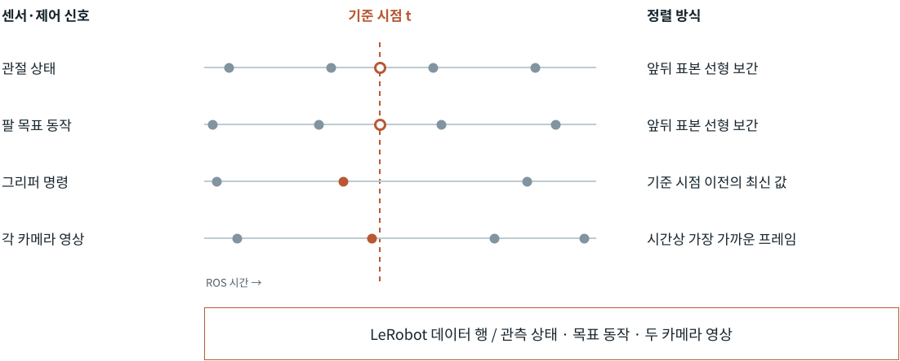
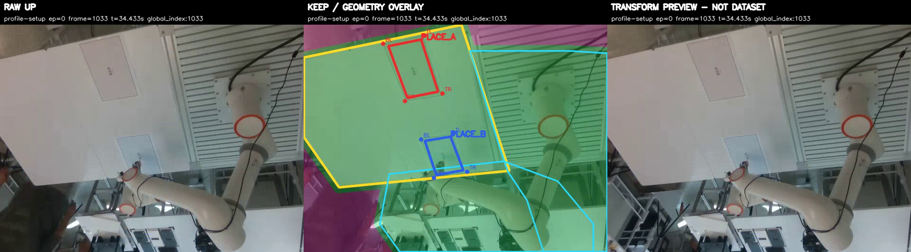

# Recorder · Curator

영상·상태·동작을 같은 시각에 맞추고, 원본과 판정을 보존하며 학습할 시연을 구성한다.

## 시간 정렬



[Recorder](../tools/fr5_lerobot_recorder.py)는 정렬 거리와 수신 지연을 각각 검사해 시간상 유효한 관측으로 학습 표본을 만든다.

<details>
<summary>입력 계약 · 정렬 계산 · 저장 기준</summary>

## 입력 계약

기본 30 Hz 행에는 7D `observation.state`, 7D `action`, RGB와 자연어 `task`가 들어간다. source·corrected·received timestamp와 provenance를 함께 보존한다. 30 Hz는 행의 기준 시각이며 카메라별 새 프레임의 도착 주기와 구분한다.

| 신호 | 기준 시각 t의 값 | 유효성 검사 |
| --- | --- | --- |
| 관절 상태·팔 목표 동작 | 앞뒤 표본의 선형 보간 | 양쪽 표본이 존재하고 각각 허용 시간 안에 위치 |
| 그리퍼 명령 | t 이전의 최신 명령 | 명령의 나이가 허용 시간 이내 |
| 카메라 | t와 가장 가까운 실제 프레임 | 시각 차이와 전송 지연을 각각 검사 |

`q(t) = q₀ + (t − t₀) / (t₁ − t₀) × (q₁ − q₀)`

[정렬 함수](../tools/time_alignment.py)는 조건에 맞는 표본이 없으면 값을 만들지 않는다. 같은 영상 프레임을 재사용한 경우 원본 시각과 반복률을 남긴다.

## 필수 자동 기준

[Schema의 QUALITY_LIMITS](../tools/fr5_dataset_schema.py), Recorder와 [dataset validator](../tools/validate_lerobot_dataset.py)가 공유하는 기본 기준이다.

| 영역 | 기준 |
| --- | ---: |
| row FPS | 설정 FPS의 ±10% |
| row gap | 설정 주기의 2배 초과가 전체 1% 이하 |
| row·camera pause | 250 ms 이하 |
| 저장 후 camera source FPS | dataset FPS의 75% 이상 |
| live 시작 camera gate | 30 Hz profile의 28.5 Hz 이상 |
| camera frame 반복률 | 25% 이하 |
| 영상·팔 명령의 정렬 거리, 상태·그리퍼 명령의 허용 나이 | 50 ms 이하 |
| camera transport age | 300 ms 이하 |
| writer queue drop / alignment failure | 0 |

저장 데이터의 brightness·clipping·sharpness·색 변화량은 검토용 지표이다. 이 지표의 warning만으로 자동 폐기하지 않는다. 실제 시작 조건은 [OneJob](../tools/data_factory/run_job.py)의 live gate에서 별도로 검사한다.

</details>

## Selection · 학습 데이터 구성

| 보존하는 근거 | 담당 모듈 | 다음 소비 |
| --- | --- | --- |
| 영상·행 구조·시간 정합 | Dataset Validator | 기술적으로 유효한 시연 |
| 작업 수행·가시성 판정 | Candidate Review | 기술·작업 판정이 PASS인 선택 목록 |
| 원본·판정 참조, 선택한 시연 | Curator Selection | Training Review / Training Entrypoint |
| 승인한 데이터와 평가 배정 | Training Entrypoint | 학습·정규화·정책 비교 |

[Selection](../tools/data_factory/curator/workflow/selection.py)은 선택 목록과 기존 근거를 전달한다. 원본을 바꾸거나 부적합한 항목을 조용히 제외하지 않는다. 학습 소비자가 현재 데이터와 참조를 다시 검사한 뒤 요청을 발행한다. 요청 상태는 `REQUEST_NOT_APPROVED`이며 학습 승인은 [별도 경계](training-and-evaluation.md#승인과-실행-미리보기)이다.

<details>
<summary>요청 발행 · 변경 감지 · 원본 보존</summary>

## 기존 판정으로 학습 요청 준비

`python3 -m tools.data_factory.curator training-request --help`에서 입력 옵션을 확인한다. 선택한 Collection run의 ledger/state를 읽고 기술·작업 판정, 중복 시연, dataset root/repo를 검증한다. 서로 다른 dataset의 통합은 아래의 `mapped-training-request` 경로가 담당한다.

원본을 순차 기록할 때의 Collection 식별값과 학습 시점의 frozen byte identity를 구분한다. [prepare_approvals](../tools/data_factory/training_entrypoint.py)는 현재 원본·metadata·semantic 근거·ledger 계보·production scope와 quarantine을 검사한다. 내부 식별자 `curator-preview-only`는 사람의 승인을 나타내지 않는다.

사전검토 후 ledger/state를 다시 읽어 변경되었으면 `SELECTION_INPUT_CHANGED`로 발행을 거부한다. 이 검사는 마지막 읽기 이후까지 잠그는 원자적 snapshot은 아니다. 출력 부모는 미리 존재해야 하며 원본·근거 경로와 겹칠 수 없다. 기존 출력과 동시 중복 발행은 `EVENT_EXISTS`로 거부한다.

발행된 요청은 이후 state 변경을 자동 반영하지 않는다. 승인 시 검증하는 frozen bytes와 요청 생성 시 확인한 freshness는 별개이다. PASS 판정은 PENDING→PASS와 동일 PASS 재전달을 지원하며, 확정된 PASS를 FAIL로 바꾸는 전이는 거부한다. [Selection 회귀](../tests/data_factory/curator/workflow/test_selection.py)는 현재 소비자 연결·입력 변경·재전달·원본 보존을 검증한다.

## 소유권과 보존

`data/`, `meta/`, `videos/`는 함께 보존하고 이동 후 다시 검사한다. Schema는 feature와 단위, Recorder는 기록 transaction, Validator는 저장 데이터 검사를 소유한다. 원본 참조와 파생 계보는 각 dataset의 metadata와 ledger에 남긴다. 작업 판정·학습 승인·정책 평가 결과는 서로 다른 근거이다.

</details>

## Video Transform · 작업 영역 보존



작업대·로봇 동작 영역을 보존 마스크로 지정하고, 바깥에는 표본 영상의 픽셀별 중앙값 배경을 적용한다. 상태·동작·작업 지시·시각과 원본 프레임 대응을 유지해 영상 조건을 바꾼다.

<details>
<summary>변환 검토 · 파생 데이터의 학습 연결</summary>

## Curator의 제한된 영상 검토

`prepare`는 source 계약과 확정한 view profile을 확인해 변환 후보를 만든다. 원본 대비 보존 열·파생 프레임·pixel metric을 검사하고, 실제 디코딩한 후보 영상으로 raw/overlay/candidate 검토 자료를 구성한다. manifest는 source·candidate·profile·policy와 선택한 표본을 결속한다. 물리 binding이 `PREPARED_NOT_VERIFIED`이면 profile 확정과 candidate 생성을 허용하지 않는다.

Web의 [review_candidate / submit_human_review_decision](../tools/data_factory/curator/workflow/application.py)은 검토 영상·coverage·허용된 결정을 읽고, 화면에 표시한 review digest와 사람의 선택을 기존 발행 경로에 전달한다. 서버가 actor와 경로를 정한다. 오래된 화면·다른 run의 digest·상반된 재전달은 거부하고, 같은 결정의 재전달과 receipt 기록 실패는 기존 결과에서 복구한다. 후보 승인은 학습 승인과 구분한다. [Native Web 검증](../tests/data_factory/curator/workflow/test_application.py)은 TTY 없는 결정, 동시 재전달·복구와 원본 보존을 다룬다.

[Review sampler](../tools/data_factory/curator/review/sampling.py)는 task 대표 clip 뒤에 아직 드러나지 않은 검토 이유를 많이 포함하는 clip을 우선한다. 동률이면 새 frame 수·전체 이유 수·고정 seed 순으로 정한다. `brightness:min`과 `brightness:max`는 별도 이유이며 이미 선택한 frame만 반복하는 clip은 추가하지 않는다. 짧은 경계 사건이 긴 일반 영상에 밀리는 경우를 줄이기 위한 선택이다.

검토 영상의 coverage는 선택된 표본의 범위이다. 데이터 분포는 [Data Quality Analysis](../tools/data_factory/quality/coverage_report.py), 작업 판정은 [Candidate Admission](../tools/data_factory/candidate_admission.py), 다음 수집은 [Collection Recommendation](../tools/data_factory/collection_recommendation.py)이 소비한다. [Manifest 회귀](../tests/data_factory/curator/review/test_manifest.py)와 [native prepare 검증](../tests/data_factory/curator/workflow/test_application.py)은 합성 source의 실제 영상 생성·재해독·digest 및 원본 보존을 확인한다.

## TRAIN 전용 변환 기준

원본과 정제 영상의 정책을 비교할 때, 배경판까지 TRAIN에서 만들어야 평가 영상의 외관이 변환 기준에 섞이지 않는다. [setup export](../tools/data_factory/curator/workflow/setup.py)의 `fit_split` 인자와 `setup export --fit-split`은 native v3 split의 원본 경로·내용 digest를 확인하고 TRAIN 프레임에서 기준 이미지·배경판 표본을 고른다. 명시한 기준 frame도 TRAIN 소속이어야 하며, 생략하면 첫 TRAIN frame을 쓴다. 표본 예산은 기존 설정을 따른다.

v2 profile에는 split 경로·파일 hash·native digest와 실제 디코딩한 표본의 global/episode/local index·RGB digest가 남는다. [Profile resolution](../tools/data_factory/curator/profile/registry.py)이 이를 profile digest에 포함하고 파생 계보가 참조한다. 원본과 split은 동결하며, 변경된 split은 검토·확정 단계에서 거부한다. 옵션 없는 v1 profile은 기존 동작을 유지하므로 TRAIN 전용 fitting 근거로 사용할 수 없다.

승인된 `fr5-up-wrist-fixed-view-r002`의 시각 기준은 유지한다. 보존 영역 밖에 사람이 보일 수 있다는 알려진 특성 때문에 기준을 자동 변경하지 않는다. 이 승인과 profile 확정·physical binding·TRAIN fitting·학습 권한은 별도 근거이다. fitting 기록은 mask의 의미적 정확성이나 사람이 heldout을 보지 않고 조정했다는 증명이 아니다. profile만으로 참조 자산·split이 패키징되지는 않는다. [Setup 검증](../tests/data_factory/curator/workflow/test_setup.py)은 export→preview→합성 binding의 finalize→candidate 검토와 stale split 거부를 확인한다.

## 변환 데이터의 학습 승인

`training-request --derivation reference.json`은 기존 Collection run 선택을 발행된 파생본에 연결한다. reference는 `run_directory`, `receipt_digest`, `parent_dataset_identity`를 가지며, 부모 identity는 dataset/repo/root/content digest를 결속한다. [파생 근거 소비자](https://github.com/hasemu1211/fr5-lerobot-connector/blob/e4d7ed978cb5d8f082ec4f579b6d392bde604284/tools/data_factory/curator/workflow/derivation.py)는 PUBLISHED receipt·APPROVE 결정·현재 원본과 출력, 보존 열·계보·검토 manifest를 대조한다. 요청의 dataset은 파생본, ledger/semantic 참조는 부모이며 상태는 `REQUEST_NOT_APPROVED`이다.

기존 `prepare_approval_batch`와 Web Training Review에서 새 exact batch를 승인한다. 부모 판정은 `PARENT_PASS`, child의 새 의미 판정은 `NOT_ASSERTED`로 구분한다. 파생 provenance v3와 새 dataset digest를 결속한 승인이 current inventory와 launch 사전검증으로 이어진다. raw batch의 승인이나 standing delegation은 다른 파생 root/repo에 적용되지 않는다.

지원 변환은 static UP keep-mask/background-plate와 WRIST H264 재인코딩이다. action·state·task·timestamp·episode/frame 대응과 원본 provenance를 보존하고, 검증된 pixel evidence를 동결된 내용 digest에 묶는다. 발행 후 playback이 없어도 recorded manifest의 검토 coverage는 유지한다. manifest·계보·원본·파생 내용이 누락되거나 변하면 admission을 거부한다. 원본과 기존 요청은 덮어쓰지 않는다.

[파생 학습 요청 검증](https://github.com/hasemu1211/fr5-lerobot-connector/blob/e4d7ed978cb5d8f082ec4f579b6d392bde604284/tests/data_factory/curator/workflow/test_derived_training.py)은 합성 출판→Web 결정→inventory→`prepare_launch`, 변조·replay·거절·부분 발행·raw 권한 재사용 거부를 다룬다. Learning은 부모 split·평가 cohort·저장된 observation view와 raw/baked 변환의 정확히 한 번 적용을 별도로 검증한다. 이 경로는 physical binding 확정이나 새 semantic PASS를 만들지 않는다. 실제 파생 학습과 mask 효과는 원본 대비 실험으로 판단한다.

</details>

## Selection Utility · 비교 실험

데이터 선택의 목적은 정책에 유용한 시연을 찾는 것이다. [Data Quality in Imitation Learning](https://arxiv.org/abs/2306.02437)은 상태 다양성만으로 품질을 판단할 수 없음을 보이고, [Data Scaling Laws](https://arxiv.org/abs/2410.18647v4)는 환경·물체 다양성과 단순 시연 수의 효과를 구분한다. 이 프로젝트는 선택 가설을 같은 평가 조건에서 비교할 수 있도록 데이터와 분할의 대응을 보존한다.

| 비교에서 바꿀 것 | 함께 맞출 것 | 평가할 것 |
| --- | --- | --- |
| 조건이 밀집한 선택 / 넓게 분산된 선택 | 시연·frame 예산, task와 평가 cohort | 같은 관측에서의 동작 오차 |
| 원본 영상 / 보존 영역 밖을 치환한 영상 | 원본 시연·기록 구간·학습 설정 | 영상 조건 변화에 대한 정책 비교 |
| 균형 수집 / 정책 피드백 기반 수집 | 추가 수집 예산·학습 조건 | 실물 성공률과 수집·복구 비용 |

표는 비교 설계이다. 현재 확인된 학습 결과는 [Policy Learning](training-and-evaluation.md#오프라인-평가), 다음 수집의 구현과 가설은 [데이터팩토리 계약](data-factory.md)에서 이어진다.

<details>
<summary>평가 cohort 유지 · 재현 명령 · 연구 근거</summary>

## 성공 조건의 반복 수집

새 위치를 넓히는 수집과 이미 성공한 조건을 반복하는 수집은 다른 실험이다. 조건마다 성공 시연이 한 번씩 분산되어 있다면 TRAIN의 성공 조건을 반복해 동작·관측의 변동을 확인할 수 있다. [SmolVLA 공식 가이드](https://huggingface.co/docs/lerobot/main/smolvla)의 SO100 사례는 5개 위치에서 각 10회 시연을 사용한다. FR5의 최소 수량이나 반복의 성능 보장으로 전용하지 않는다.

[Ledger](../tools/data_factory/episode_ledger.py)와 [native split](../tools/data_factory/training_split.py)으로 합격 TRAIN을 확인하고 [DQA](../tools/data_factory/quality/coverage_report.py)의 조건별 관측을 선택 이유로 남긴다. [Direct pose projection](../tools/data_factory/operator/catalog.py)으로 등록된 preset·위치·yaw·시도 수를 지정하고, [CampaignOperator](../tools/data_factory/campaign_operator.py)의 `update_draft`→`compile_draft`로 slot 순서·수량을 확인한다. 입력 dataset/split, source digests, 선택 조건과 compiler receipt를 보존한다. 대표 선택과 반증 조건은 [Curation design](../openspec/changes/curation-learning-loop/design.md)에 둔다.

이 authoring은 새 수집 권한을 주지 않는다. Collection이 현재 scene·장치·실행 자격을 검증한다. 새 episode 추가는 sorted-last split의 heldout을 바꿀 수 있으므로 Learning이 실제 분할을 다시 확인한다. 반복 시도 수·합격 시연 수·전체 취득 비용은 각각 측정한다.

## 여러 원본의 매핑과 평가 배정

[Mapped request producer](https://github.com/hasemu1211/fr5-lerobot-connector/blob/e4d7ed978cb5d8f082ec4f579b6d392bde604284/tools/data_factory/curator/workflow/mapping.py)의 `publish_mapped_training_request`는 frozen raw 요청과 ledger/state를 검증하고 native merge로 별도 dataset을 만든다. 전체 원본과 영상을 복사하되 학습 요청은 명시한 선택만 포함한다. source별 episode 수가 달라도 dataset identity와 episode/global index 대응을 보존하며, 기존 평가 cohort가 정확히 대응하지 않으면 발행하지 않는다. caller가 복사 예산을 지정한다.

`meta/curator_mapping.json`은 원본 provenance 바이트와 episode 번호를 재결속한 recording-quality projection을 구분한다. [Validator](../tools/validate_lerobot_dataset.py)가 task 의미, action/state/timestamp/frame, 영상 바이트·시각 구간과 timing 근거를 검사한다. Arrow의 고정 길이 벡터가 리스트로 저장된 경우도 원소 dtype·길이·값이 같아야 한다. `request.json`의 `mapping.publication_root`·`mapping.manifest_digest`는 새 dataset·technical result와 함께 원자적으로 발행된다.

`prepare_mapped_approvals(request, output, approved_by, check_targets=True)`는 기존 `(dataset, drafts)`를 반환하며 승인이나 inventory를 쓰지 않는다. provenance v4는 부모 semantic 참조와 새 destination identity를 구분한다. Web은 원본 대응·부모 PASS·새 의미 판정 `NOT_ASSERTED`를 표시하고, 새 exact-batch 승인만 inventory로 연결한다. 학습 준비는 원본 collection profile과 동결된 TRAIN/EVAL 대응을 다시 확인한다. 이미지가 유지되므로 observation view는 raw이다. reindexing은 이미지 파생 v3와 구분한다.

[Mapping 검증](https://github.com/hasemu1211/fr5-lerobot-connector/blob/e4d7ed978cb5d8f082ec4f579b6d392bde604284/tests/data_factory/curator/workflow/test_mapping.py)은 합성 출판→Web 결정→inventory→학습 준비와 평가 대상 변경 거부를 확인한다. 실제 결합 비용과 학습 효용은 이 테스트의 측정 범위에 포함되지 않는다.

## 통제된 selection utility 비교

기존 승인 전 TRAIN pool에서 x/y/yaw·녹화량·phase 시간을 읽고 선택을 구성한다. 동일 조건의 train/eval 노출과 원본 중복도 확인한다. 같은 frame 수는 동일 optimizer 노출이나 전체 취득 비용을 뜻하지 않으므로 모델·seed·학습 예산과 reset·사람 개입 비용을 별도로 맞춘다.

`training-request`의 `--eval-split`과 반복 가능한 `--expected-eval-episode`를 함께 지정하면 기존 task별 splitter의 결과를 기대 cohort와 대조한다.

```sh
python3 -m tools.data_factory.curator training-request \
  --run-dir "$RUN_A" --run-dir "$RUN_B" --run-dir "$RUN_C" \
  --dataset-id "$DATASET_ID" --output "$NEW_REQUEST" \
  --eval-split "$EVAL_FRACTION" --expected-eval-episode "$HELDOUT_EPISODE"
```

불일치는 `SELECTION_EVALUATION_CHANGED`로 발행 전에 거부한다. preview의 `evaluation_cohort`는 launch split을 강제하지 않으므로 학습 소비자가 같은 fraction과 실제 분할을 확인한다.

[Selection 시나리오](../openspec/changes/curation-learning-loop/specs/curation-learning-loop/spec.md)와 [CLI 회귀](../tests/data_factory/curator/test_cli.py)는 합성 입력으로 검증한다.

```sh
PYTHONDONTWRITEBYTECODE=1 direnv exec . python3 -m unittest \
  tests.data_factory.curator.workflow.test_selection \
  tests.data_factory.curator.test_cli \
  tests.data_factory.curator.test_architecture --durations 5
```

TRAIN subset마다 정규화 통계가 달라질 수 있다. 각 checkpoint의 저장된 postprocessor로 복원한 동작이나 동일 조건의 실물 평가를 비교한다. 서로 다른 척도의 normalized flow loss를 그대로 효용 순위로 쓰지 않는다. 반복 개발에 사용한 평가 cohort는 독립 최종 시험과 구분한다.

## 조건 단위의 재시연과 DAgger

[DAgger](https://proceedings.mlr.press/v15/ross11a/ross11a.pdf)의 질의 대상은 정책이 방문한 상태이며, expert는 사람이나 프로그램일 수 있다. 현재 FR5의 재수집 경로는 원본 조건에 대응한 사람의 실행 구간 판정을 받아, 확인된 장면과 적격 recipe로 다음 시연을 구성한다. 실패 직후의 임의 상태에서 recovery action을 생성하는 계약과는 범위가 다르다.

이 기반으로 조건별 재시연을 자동화해 수동 correction의 부담을 줄일 수 있는지 검토한다. 같은 추가 데이터·학습 예산의 표적 수집과 균형 수집, 실제 사람 개입량을 비교해야 효과를 판단할 수 있다.

## 성공 예제의 다양성과 비용 가설

관절 경로를 누적 길이의 같은 비율에서 비교하는 기준선은 조건 차이를 탐색하는 도구이다. 물체·배경·조명·그리퍼의 다양성을 모두 나타내지 않으며, 재표본화는 정지 시간을 제거한다. 가까운 경로와 먼 경로의 차이에는 요청한 place·위치·yaw가 섞일 수 있다. 녹화량도 reset과 사람 노력을 포함한 취득 비용과 구분한다.

[DemInf](https://arxiv.org/abs/2502.08623v3)는 보조 표현과 상호정보량, [FAKTUAL](https://arxiv.org/abs/2603.11634v1)은 궤적 kernel의 다양성, [DataMIL](https://arxiv.org/abs/2505.09603v2)은 정책 기반 선택, [ReMix](https://proceedings.mlr.press/v270/hejna25a.html)는 데이터 혼합을 다룬다. 이 방법들을 FR5의 구현 알고리즘으로 주장하지 않는다. 경로·조건 분산이 같은 예산의 학습 이득으로 이어지는지는 비교 실험으로 판단한다.

</details>

장비 앞의 실행·중단·복구는 [운영자 런북](operator-runbook.md), 학습 승인·분할·평가는 [학습과 평가](training-and-evaluation.md)가 설명한다.
