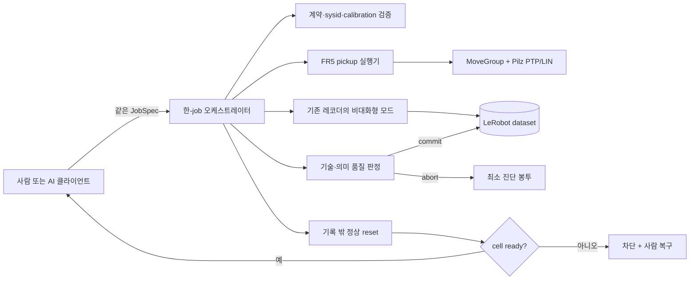

# FR5 데이터 팩토리·파이프라인 통합 계획

> 상태: `ARCHIVED`. 현재 작업 순서는 `plans/data-factory-next-iteration.md`를 따른다.

> 2026-08-20 이후 실행 순서의 정본은 `plans/data-factory-next-iteration.md`다. 이 문서는 초기 설계 기준선과 장기 계약을 보존하며, 현재 구현 상태·다음 Goal 순서가 충돌하면 새 계획을 우선한다.

- 상태: 독립 설계 검토 및 `C-06` 정본 정정 승인
- 작성 기준일: 2026-08-14
- 계획 범위: 설계와 검증 계약만 포함하며 제품 코드는 구현하지 않는다.
- 첫 qualification 후보 환경: FR5, Lenovo IdeaPad 5 15ITL05, 16 GB RAM, Ubuntu 24.04, D435 1대, UVC 카메라 1대
- 첫 라이브 태스크: `pickup_e2e`
- 장기 목표: 같은 계약으로 `pick_place`, 다물체, 두 번째 로봇 시스템까지 단계적으로 확장 가능한 운영 제품
- 검토 기록: architect `APPROVE_WITH_NONBLOCKING_NOTES`, critic `APPROVE`, verifier `APPROVE`; OMX Ralplan 공식 합의는 preflight 미지원으로 주장하지 않음

이 계획과 짝인 검증 계약은 2026-08-14 인터뷰의 최신 결정을 정리한 **구현 전 decision package**다. `docs/data-factory.md`는 이 package에 맞춰 정정했으며 기존 deep-interview spec은 `SUPERSEDED HISTORY`로 보존한다. `C-06`은 독립 검토를 통과했지만 live capability와 training 승격은 각 단계의 HIL·품질 gate 전에는 허용하지 않는다.

## 1. 결론

첫 구현은 범용 프레임워크가 아니라 **검증 가능한 한 개의 수직 슬라이스**다.

- A4 한 장은 `(place, yaw)`를 나타내고, 중앙 기준점을 회전 중심으로 하는 격자에서 `(x, y)`를 사람이 읽는다.
- 로봇은 `place`의 yaw 0 기준에서 측정한 `CENTER`, `X_REF`와 별도 테이블 평면 법선으로 좌표계를 구성하고 `Y_CHECK`는 독립 검증점으로만 쓴다.
- 물체 목표 pose의 권위는 A4/물리 지그와 TCP 측정값이다. 카메라는 데이터 기록과 사후 감사에 쓰며 첫 단계의 pose label 권위가 아니다.
- 기존 레코더의 정량 게이트를 보존하고, 그 앞뒤에 JobSpec 검증, 한-job 실행, 사람의 의미 성공 판정, 기록 밖 reset, commit/abort를 추가한다.
- 오케스트레이터는 한 job만 소유한다. AI도 검증된 한 job의 실행과 정상 reset까지만 책임지며 다음 job은 사람이 다시 승인한다.
- commit 전 어느 모듈이든 실패하면 **학습용 무거운 페이로드는 폐기**하고, 재현과 원인 분류에 필요한 **최소 진단 봉투**만 보존한다. reset-only failure도 예외로 episode를 살리지 않는다.
- 범용 로봇 플러그인, 비전 기반 물체 pose 추정, MoveIt Task Constructor, 분산 서비스는 두 번째 실제 사용 사례가 생기기 전에는 만들지 않는다.

이 범위는 작은 데모가 아니라, 좌표 권위·안전·데이터 트랜잭션·품질 증거가 연결된 포트폴리오용 최소 완결품이다. 다만 이 첫 소량 데이터만으로 고품질 VLA 학습량을 달성했다고 주장하지 않는다.

## 2. 현재 근거와 부족한 연결부

### 저장소에서 확인된 강점

- 현재 흐름은 `preflight_collection.sh --live -> collect.sh -> fr5_lerobot_recorder.py -> validator -> preview -> training approval`이다.
- `tools/fr5_dataset_schema.py`에 30 Hz, 간격, pause, queue drop, RGB 정렬·전송 지연, source FPS, state/action/gripper age와 RGB decode 게이트가 이미 있다.
- 과거 실측 감사에는 dual RGB 30 Hz, 1,040 rows/34.63 s, queue drop 0, alignment failure 0, swap 0, recorder 최대 RSS 1.23 GB가 기록되어 있다.
- `tools/a4_place_yaw/`는 A4 중앙 회전, 35 mm 격자, `CENTER/X_REF/Y_CHECK`, JSON/SVG/PDF 분리 출력을 이미 지원한다.
- 현 테스트 기준선은 16개가 통과한다.

### 첫 구현 전에 닫아야 할 틈

1. 현재 `r/s/c/q/f` 키 흐름은 사람 대화형으로만 제어되며 AI/오케스트레이터용 결정론적 명령 계약이 없다.
2. 기술 품질을 통과한 버퍼가 바로 저장된다. `freeze -> semantic verdict -> reset -> commit/abort` 경계가 없다.
3. 성공 판정이 dataset 단위 `training_approved.json`에만 있고 episode별 의미 결과와 실패 사유가 없다.
4. 수동 discard는 버퍼만 비우므로 디버깅에 필요한 최소 진단도 남기지 않는다.
5. A4 좌표 정의는 있으나 반복 측정, 인쇄 스케일, 물체 배치 허용오차와 grasp 여유를 묶은 현장 적격성 판정이 없다.
6. 기존 문서의 완료 예시는 place까지 포함하지만 첫 라이브 범위는 pickup 후 hold, 의미 판정, 기록 밖 원위치 reset이다.
7. 16 GB 노트북에서 D435, UVC, FR5 전용망, DDS, writer, batch encode가 동시에 동작하는 실제 포트/자원 번인이 필요하다.
8. LeRobot v3의 `save_episode()`에는 안전한 마지막 episode rollback API가 없다. 커밋 중간 장애를 “모두 자동 삭제”한다고 약속할 수 없다.
9. 이전 정본의 “semantic pass 뒤 reset-only failure면 episode 보존” 예외는 최신 “모듈 실패 시 학습 payload 폐기” 원칙과 충돌했다. `docs/data-factory.md`를 정정하고 `C-06` 독립 재검토를 통과했다.

## 3. 외부 근거 삼각검증

| 설계 판단 | 독립 근거 | 계획 반영 |
|---|---|---|
| 작업 평면은 원점과 축 방향으로 정의하고 제3점으로 검증 | [Universal Robots plane feature](https://www.universal-robots.com/manuals/EN/HTML/SW5_21/Content/prod-usr-man/software/PolyScope/content/installation_g5/installation_features_en.htm), [UR palletizing feature](https://www.universal-robots.com/manuals/EN/HTML/SW5_21/Content/prod-usr-man/software/PolyScope/content/Template/new_pallet_en.htm) | `CENTER + X_REF + plane normal`로 fit, `Y_CHECK`는 독립 검증 |
| robot/place transform는 SI metre의 translation+rotation 강체 변환이며 인쇄·측정 residual을 runtime scale fit에 흡수하지 않음 | [ROS REP-103](https://www.ros.org/reps/rep-0103.html), [ROS 2 geometry_msgs/Transform](https://docs.ros.org/en/rolling/p/geometry_msgs/msg/Transform.html), [NIST TN 1297 §5](https://www.nist.gov/pml/nist-technical-note-1297/nist-tn-1297-5-combined-standard-uncertainty) | `CENTER + projected X_REF + validated plane normal`로 `SE(3)` 구성; 100 mm 막대·manifest X_REF 거리·Y_CHECK는 기록·독립 acceptance gate |
| 카메라 보정은 렌즈/카메라 기하를 보정하지만 임의 물체 pose를 결정론적으로 만들지는 않는다 | [OpenCV calibration](https://docs.opencv.org/4.13.0/dc/dbb/tutorial_py_calibration.html), [ChArUco calibration](https://docs.opencv.org/4.13.0/da/d13/tutorial_aruco_calibration.html) | 카메라는 기록·주기적 판 검사에만 사용; label authority는 A4/지그/TCP |
| 대규모 로봇 데이터는 task·환경·성공 결과·metadata의 일관성이 중요하다 | [DROID](https://droid-dataset.github.io/), [Open X-Embodiment](https://github.com/google-deepmind/open_x_embodiment), [LeRobot recording guide](https://github.com/huggingface/lerobot/blob/main/docs/source/il_robots.mdx) | episode별 semantic result, JobSpec/calibration/profile digest, coverage ledger |
| 연속 동작 수집은 고빈도 관찰과 episode 경계·품질 판정이 필요하다 | [ALOHA/ACT](https://arxiv.org/abs/2304.13705), [LeRobot recording guide](https://github.com/huggingface/lerobot/blob/main/docs/source/il_robots.mdx) | 기존 30 Hz 게이트 유지, 한 job 단위 freeze/commit 경계 추가 |
| workspace와 학습 payload의 소유 경계를 분리해야 한다 | [colcon workspace](https://colcon.readthedocs.io/en/released/user/what-is-a-workspace.html), [LeRobot dataset tools](https://huggingface.co/docs/lerobot/using_dataset_tools), [LeRobot writer pin](https://github.com/huggingface/lerobot/blob/6adf51511b7625090eade8d82d9f61a1846ebe56/src/lerobot/datasets/dataset_writer.py) | `build/install/log`는 colcon에 남기고, heavy episode는 dataset root 한 곳만 소유하며 run root에는 pointer·진단만 저장 |
| 다중 카메라는 USB 대역·안정성·식별을 실제 배선에서 검증해야 한다 | [RealSense D400 multi-camera white paper, rev. 1.2](https://dev.realsenseai.com/download/18385/), [realsense-ros](https://github.com/realsenseai/realsense-ros) | 포트 토폴로지 캡처와 30분 번인, serial/by-id 고정 |
| 안전 정지는 노트북/ROS 정상 동작에 의존하지 않아야 한다 | [ISO 10218-2:2025](https://committee.iso.org/standard/73934.html), [FAIRINO safety manual](https://manual.fairino.support/latest/CobotsManual/safety.html) | 하드웨어 안전 유지, 통신 장애 시 새 motion 금지, home 복귀를 안전 정지로 간주하지 않음 |
| 단순 산업 경로는 검증된 PTP/LIN으로 시작할 수 있다 | [MoveIt MoveGroupInterface](https://moveit.picknik.ai/main/api/html/classmoveit_1_1planning__interface_1_1MoveGroupInterface.html), [Pilz PTP/LIN](https://moveit.picknik.ai/main/doc/how_to_guides/pilz_industrial_motion_planner/pilz_industrial_motion_planner.html) | 첫 단계는 기존 MoveGroup + Pilz PTP/LIN; 복잡한 task graph는 유보 |
| FAIRINO force/compliance/impedance는 별도 센서 구성·영점과 vendor API를 요구한다 | [FAIRINO force control](https://fairino-doc-en.readthedocs.io/latest/SDKManual/PythonRobotForceControl.html), [FAIRINO MoveIt2 guide](https://fairino-doc-en.readthedocs.io/latest/ROSGuide/moveIt2.html) | 현재 position-only FJT와 혼용하지 않음; 외장 6축 F/T 센서와 단독 motion ownership을 검증한 뒤 후속 도입 |
| learner가 유발하는 상태에서 expert 교정 행동을 모아야 누적 오차를 다룰 수 있다 | [DAgger](https://proceedings.mlr.press/v15/ross11a.html), [DemoGen ADR](https://demo-generation.github.io/) | nominal 안정화 뒤 pregrasp bounded recovery를 성공 branch로 별도 수집 |
| object-centric contact segment와 free-space replanning을 구분해야 한다 | [MimicGen](https://arxiv.org/abs/2310.17596), [DemoGen](https://arxiv.org/abs/2502.16932) | approach/pregrasp만 재계획·교란; contact/close/lift 의미는 보존 |
| 여러 유효 행동 모드를 조건 없이 섞으면 단순 회귀가 평균화될 수 있다 | [ACT](https://tonyzhaozh.github.io/aloha/), [Diffusion Policy](https://diffusion-policy.cs.columbia.edu/) | phase/candidate/recovery branch를 명시; first MVP는 한 qualified action mode |
| grasp 후보는 안전성 gate 뒤 robust quality로 순위화한다 | [Dex-Net 2.0](https://arxiv.org/abs/1703.09312) | 임의 가중합 “optimal” 대신 hard-gate 후 best-available 선택 |

외부 자료는 방향을 뒷받침할 뿐, 이 노트북의 RAM·USB·지연 임계치를 대신하지 않는다. 최종 지원 판정은 현장 반복 측정과 번인 결과로 고정한다.

### 제공된 원본 설계서 반영 범위

`FR5_VLA_지도_궤적_데이터_생성기_설계서.docx`의 핵심은 다음처럼 반영한다.

| 원본 개념 | 판정 | 이 계획의 위치 |
|---|---|---|
| 알려진 grasp/place pose에서 의미 있는 실행 궤적 생성 | 채택 | A4/TCP pose authority, JobSpec, phase별 실행 |
| object/grasp frame을 계획·실행·기록에서 일관되게 유지 | 채택 | sysid/TCP/calibration/profile digest |
| 자유공간과 접촉 근처 phase를 분리 | 채택 | PTP pregrasp, 저속 LIN approach/lift, gripper phase |
| 계획값보다 실제 command/state와 품질 결과를 우선 기록 | 채택 | 기존 7D recorder와 RunResult/phase event |
| RGB는 선택적으로 동기화하되 실제 파지 성공은 별도 판정 | 채택·강화 | RGB는 기록/감사, 사람 semantic verdict가 권위 |
| MTC 기반 pick-place | 첫 단계에서 대체 | 단일 pickup은 MoveGroup action + Pilz PTP/LIN; 분기가 실제 생기면 MTC 재평가 |
| pose/start sampler와 다수 자동 episode | 후속 | 첫 accepted/rejected 수직 슬라이스 뒤 coverage ledger와 sampling |
| perturb-and-recover, curriculum, MimicGen-lite, policy loop | 후속 | 안정된 단일 물체 factory 뒤 simulation/PlanningScene부터 단계적으로 검토 |
| 3 mm/3°·성공률 같은 예시 수치 | 그대로 채택하지 않음 | 현장 pose/grasp margin과 반복 측정으로 qualification threshold 고정 |

즉, 원본의 “구조적 실행 데이터” 철학은 보존하고, 현재 장비·안전·데이터 admission이 준비되지 않은 MTC/자동 sampling/recovery만 뒤로 보낸다.

### 코드베이스-계획-외부근거 삼각검증 gate

#### 입력 자료 pin과 계약 supersession

- 원본 설계서: `/home/codelab/Downloads/FR5_VLA_지도_궤적_데이터_생성기_설계서.docx`, SHA-256 `c3edae833805affb88bf749f501cd0c67a5fbee560071d2e78efde527f7ea04b`, mtime `2026-08-14 10:19:21 +0900`
- 노트북 사양: `/home/codelab/Downloads/노트북_하드웨어_사양.md`, SHA-256 `ac48042062d4d70e780cedbb727edd823626db00056897d479bfecad87327860`, mtime `2026-08-14 14:02:38 +0900`
- superseded canonical snapshot: `docs/data-factory.md`, 정정 전 SHA-256 `87ee22bfc7a4d0d1a2a875e01617bc4151cbc70c4113f51531e1a36fab56eea3`
- superseded 인터뷰 snapshot: `plans/archive/deep-interview-data-factory-pipeline-integration.md`, marker 추가 전 SHA-256 `ee7e62cf444bad2a11bd085e1cdb29fcccfb46b81fdbe0cc87a304ed843250ac`

이전 snapshot은 provenance로만 보존한다. 현재 `docs/data-factory.md`는 “모듈 실패 시 payload 폐기”, first `pickup_e2e`, fixed nominal `top_center`와 기존 품질 SSOT를 반영한다. deep-interview 본문은 당시 답변을 지우지 않고 상단 marker로 비권위 history임을 밝힌다. 단계 0의 `C-06` 재검토는 통과했으며 이후 구현은 단계별 qualification/HIL gate를 따른다.

motion, 안전, 데이터 수명주기, 품질, sampling, hardware 지원에 영향을 주는 모든 결정은 다음 세 축을 함께 가져야 한다.

1. **코드베이스·실측:** 현재 source/config/test/dataset/hardware 측정이 실제로 무엇을 지원하는가.
2. **계획·계약:** 제공된 DOCX, canonical repo 문서, 인터뷰에서 승인된 최신 사용자 요구가 무엇을 요구하는가.
3. **외부 원문:** 제조사·표준·upstream 문서 또는 peer-reviewed/공식 프로젝트가 어떤 원칙과 한계를 보이는가.

판정은 다음으로 고정한다.

- `EVIDENCE_READY`: 세 축이 모순 없이 연결되고 검증 가능한 수용기준이 있음. 구현 전 상태일 수 있으며 “실장비 지원됨”과는 다르다.
- `CONTRACT_REPAIR_REQUIRED`: 최신 decision package와 repository 정본이 충돌한다. 정본 정정·review·digest 확인 전 구현과 승격 금지.
- `QUALIFICATION_REQUIRED`: 방향은 세 축에서 지지되지만 현재 local HIL/측정이 아직 없거나 실패함. live/training 승격 금지.
- `DEFERRED`: 한 축이 없거나 선행조건이 없음. 코드와 기본 schema에 미리 넣지 않음.
- `REJECTED`: local 사실 또는 안전/외부 근거와 충돌. 근거가 바뀌기 전 재제안 금지.

새 결정은 evidence ledger에 `claim_id`, 세 축의 file/URL/measurement, 외부 사실과 프로젝트 추론의 구분, 수용시험, version/date를 남긴다. 논문 예시 수치를 local threshold로 복사하지 않는다. 독립 reviewer는 세 축 중 하나만 인용한 결정을 승인하지 않는다. 아래 local pin은 `HEAD 22858ae + 2026-08-14 working-tree/hardware snapshot`이며, 구현 시 실제 file digest로 다시 고정한다. 외부 URL은 2026-08-14 확인 기준이다.

| Claim ID / 판단 | 코드베이스·실측 pin | 계획·계약 | 외부 원문 pin | 사실과 프로젝트 추론 | 수용시험 | 판정 |
|---|---|---|---|---|---|---|
| `DF-POSE-001` A4/TCP pose authority·강체 metric transform | A4 generator/manifest, camera pose estimator 없음; `43fb414` print provenance | DOCX known 6D pose + 승인된 `(place,yaw,x,y)` + runtime scale 금지 | UR SW5.21 plane feature; ROS REP-103 `ros-infrastructure/rep@11ca24a`; `geometry_msgs/Transform` `common_interfaces@0a91a3f`; NIST TN 1297 §5, 2023-03-01 | 사실: ROS SI metre/right-handed translation+rotation, Transform에 scale DOF 없음; NIST는 correction uncertainty 계산 요구. 추론: PDF compensation은 provenance로만 고정하고 CENTER+X_REF+normal fit에 metric offset, 100 mm/X_REF/Y_CHECK는 reject gate | `P-01..03` | `QUALIFICATION_REQUIRED` |
| `DF-MOTION-001` phase별 PTP/LIN | MoveIt/Pilz 2.12.4, FJT config, executor 없음 | DOCX free-space/contact 분리 + pickup 우선 | MoveIt/Pilz official main, 2026-08-14 | 사실: PTP/LIN/action 지원. 추론: FR5 pickup phase 선택 | `M-01,02,06` | `QUALIFICATION_REQUIRED` |
| `DF-VISION-001` camera 비권위 | dual recorder 존재, camera는 cell 밖 | 최신 사용자가 deterministic A4/TCP 권위 승인 | OpenCV 4.13 calibration/ChArUco | 사실: camera calibration 범위. 추론: 현재 label authority에서 제외 | `C-03,P-01,H-01` | `EVIDENCE_READY` |
| `DF-TXN-001` freeze/abort/commit | recorder 즉시 save; LeRobot 0.6.1 batch staging/clear source | 실패 payload 폐기+최소 진단, semantic/reset 뒤 commit | LeRobot recording guide/main, 2026-08-14 | 사실: writer lifecycle. 추론: batch-only exact StagingManifest | `R-01..06,M-05,Q-03` | `QUALIFICATION_REQUIRED` |
| `DF-FS-001` 산출물 소유권·중복 금지 | `.gitignore`, LeRobot dataset root, 기존 flat `outputs/` inventory | 기능별 root, heavy payload 단일 소유, legacy 무삭제 전환 | colcon workspace docs; LeRobot `6adf51511b7625090eade8d82d9f61a1846ebe56`, 2026-08-14 | 사실: colcon은 build/install/log, LeRobot은 metadata/parquet/videos와 temp images를 소유. 추론: run에는 pointer/진단만 두고 qualification/legacy를 분리 | `FS-01..03,R-01` | `EVIDENCE_READY` |
| `DF-RESET-001` reset failure payload 폐기 | 정정된 `docs/data-factory.md`; 이전 spec은 superseded marker | 최신 사용자 결정과 이 package는 모든 reset failure abort | ISO 10218-2:2025; FAIRINO safety latest, 2026-08-14 | 사실: previous conflict와 current repair. 추론: episode admission과 cell readiness를 fail-closed로 결합 | `C-06,M-04,Q-04` | `EVIDENCE_READY` |
| `DF-RECOVERY-001` bounded recovery | recovery code/data 없음 | DOCX V1.5 + 최신 사용자 요청 | DAgger 2011, MimicGen 2023, DemoGen 2025 | 사실: learner states/object-centric ADR. 추론: FR5 pregrasp-only recovery | `F-REC-01` | `DEFERRED` |
| `DF-SAMPLER-001` pattern-확률 sampling | sampler/coverage 없음 | DOCX task-condition sampling, path noise 배제 | DROID/Open X; DAgger/DemoGen | 사실: condition/state diversity 가치. 추론: seeded coverage sampler | `F-SMP-01` | `DEFERRED` |
| `DF-DGEN-001` nominal 이후 경로 큐레이션·object-relative 실물 생성·조건 분할 | 현재 action은 7D joint reference, pickup executor/생성 episode 없음 | 보완 가이드 V1.1~V1.3; 현재 단계 3~5와 first schema는 변경하지 않음 | [DemoGen RSS 2025](https://demo-generation.github.io/), [SkillGen CoRL 2024](https://skillgen.github.io/), [MimicGen TaskSpec](https://mimicgen.github.io/docs/modules/task_spec.html), [MoveIt OMPL](https://moveit.picknik.ai/main/doc/examples/ompl_interface/ompl_interface_tutorial.html), 2026-08-18 | 사실: DemoGen은 contact/local-skill 변환과 free-space 재계획, SkillGen은 local-skill adaptation과 motion-planned transition, MimicGen은 object-reference 변환과 interpolation bridge, OMPL은 확률적 해를 지원. 추론: 같은 관측 가능 condition의 canonical expert 하나와 condition-held-out 평가를 FR5 정책으로 사용 | `F-PATH-01,F-DGEN-01,F-SPLIT-01` | `DEFERRED` |
| `DF-GRASP-001` best-available ranking | first fixed grasp만 계획 | “최적 집기” 조절 요구 | Dex-Net 2.0 (2017), MoveIt collision/IK | 사실: robust candidate ranking. 추론: ordered hard gates+quality/recovery tie-break | `F-GRP-01` | `DEFERRED` |
| `DF-FORCE-001` impedance descent | FAIRINO 3.9.7 local position-only, effort path 주석 | 바닥 충돌·느린 final 접근 요구 | FAIRINO force/MoveIt docs latest, 2026-08-14 | 사실: F/T config/zero/impedance API. 추론: exclusive handoff gate | `F-FT-01` | `DEFERRED` |
| `DF-SAFETY-001` hardware safety 독립 | FJT single-owner/preflight, local stop path | 기존 safety hardware 존중 | ISO 10218-2:2025, FAIRINO safety latest, 2026-08-14 | 사실: safety functions/limits. 추론: software failure state machine | `M-03..05,HIL-01` | `QUALIFICATION_REQUIRED` |
| `DF-HW-001` 16 GB dual-camera 30 Hz | past 30 Hz HIL; 별도 UVC raw probe 14.5 Hz, D435 FW 5.17.0.10 | 기존 pipeline quality SSOT와 Lenovo qualification target | RealSense D400 multi-camera rev. 1.2, 2026-08-14 | 사실: raw probe는 startup 최소 22.5 Hz 미달. 추론 금지: 연결 불안정·dataset FAIL로 확대하지 않음 | `H-01..03,Q-01` | `QUALIFICATION_REQUIRED` |
| `DF-HIL-001` known-safe first motion | 2026-08-12 J4 10° round-trip/gripper/return | 최신 사용자 승인 | ROS 2 Jazzy/MoveIt action cancel docs, 2026-08-14 | 사실: 과거 local success. 추론: current sysid 일치 시 재사용 | `HIL-01,M-06` | `QUALIFICATION_REQUIRED` |
| `DF-PORT-001` generic adapter | second robot 없음 | 장기 범용 완성품은 roadmap 말단 | Open X embodiment normalization (2023) | 사실: cross-embodiment normalization. 추론: second robot에서 adapter 추출 | `F-ROB-01` | `DEFERRED` |

## 4. 최소 아키텍처



### 책임 경계

| 구성요소 | 책임 | 독립 사용 방식 | 하지 않는 일 |
|---|---|---|---|
| A4 생성기 | `(place,yaw,x,y)` 시각·기계 좌표 산출 | 기존 CLI | 로봇 측정, 물체 검출 |
| profile/calibration validator | SSOT 로드, digest와 sysid 검증, pose 계산 | `validate`/`resolve-pose` CLI와 JSON 출력 | motion, 기록 |
| FR5 pickup 실행기 | 한 job의 사전 계획, 실행, 정상 reset | CLI + JSONL 상태/결과 | dataset 저장, 다음 job 선택 |
| 기존 recorder core | begin/freeze/commit/abort, 기존 정량 품질 | 기존 사람 UI + 같은 core를 쓰는 JSONL 명령 | semantic 성공 결정, robot motion |
| 한-job 오케스트레이터 | 순서·상태·타임아웃·승인 토큰·실패 분류 | 사람 wizard 또는 `--job ... --json` | 장기 daemon, 여러 job 자동 스케줄 |
| validator/preview | committed episode와 sidecar 정합성, 사람 최종 검토 | 기존 CLI 확장 | 로봇 제어 |

첫 구현은 Python 표준 라이브러리의 dataclass/manual validation, JSON/JSONL, `subprocess`를 쓴다. 새 메시지 버스, ROS custom action, web UI, 데이터베이스, 범용 플러그인 프레임워크는 추가하지 않는다. 모듈 독립성은 같은 파일 계약과 exit code로 확보한다.

### 파일시스템 소유권

새 파일은 기능과 수명주기별 한 root만 소유한다. 경로를 설정마다 복제하지 않고 repository root에서 resolve한 뒤 path traversal과 root 밖 쓰기를 거부한다.

```text
tracked
├── docs/                                # current 계약·운영·evidence index·history
├── config/data_factory/                 # 검토된 robot/cell/object/grasp/collection JSON만
├── tools/                               # 재사용 library/CLI
├── scripts/                             # 사람용 entry point
└── tests/                               # unit/contract/fault tests

ignored runtime
├── tools/a4_place_yaw/{json,pdf,svg}/   # 사용자 지정 A4 형식별 생성물 예외
├── tools/a4_place_yaw/print_calibration/<scale_bar_mm>/{json,pdf,svg}/
├── outputs/data_factory/
│   ├── runs/<run_id>/                   # job/pose/plan/events/result/manifest/최소 진단
│   └── qualifications/<id>/             # calibration·hardware·grasp 측정
├── outputs/pipeline/                    # 독립 recorder/validator의 새 preview·diagnostic 목표
├── outputs/legacy/                      # inventory/checksum 후 이동한 과거 산출물
├── datasets/fr5_episodes/<dataset>/     # accepted LeRobot heavy payload의 유일한 copy
└── RESEARCH/                            # 외부 원문·임시 분석, 운영 정본 아님
```

run directory에는 control-plane metadata만 둔다. RGB/video/Parquet를 복사하지 않으며 `staging_manifest.json`은 LeRobot dataset root 아래 exact batch staging path만 가리킨다. commit failure는 dataset marker와 run `result.json`으로 quarantine 상태를 표시하고 별도 heavy copy를 만들지 않는다.

기존 `datasets/fr5_episodes/hil_usb_cam_30hz_20260812/`, 평평한 `outputs/diagnostics/`와 `outputs/previews/`는 삭제하지 않는다. 새 factory write를 먼저 새 root로 전환하고, 기존 산출물은 파일별 size/SHA-256/source/reference inventory가 완전할 때만 `outputs/legacy/`로 이동한다. inventory 누락, active writer 또는 참조 불명확성이 있으면 제자리 보존한다. `build/install/log`는 colcon/ROS 소유이며 factory evidence로 이동하지 않는다.

## 5. SSOT와 계약

서로 복사된 설정을 만들지 않고 다음 소수의 버전된 문서만 권위로 둔다.

### `JobSpec`

필수 필드:

- `schema_version`, `job_id`, `task=pickup_e2e`
- `robot_system_id`, `collection_profile_id`
- `place_id`, `cell_calibration_id`, `sheet_manifest_digest`, `yaw_deg`, `x_mm`, `y_mm`
- `object_profile_id`, `grasp_profile_id=top_center`
- canonical `instruction`, `episode_intent`, `operator_or_agent_id`
- `approval_expiry`, `dry_run_required=true`

알 수 없는 필드는 schema version과 함께 fail-closed한다. `pick_place` 필드는 첫 라이브 단계에서는 validation error로 돌려 구현된 것처럼 보이지 않게 한다.

사람/AI 입력에는 profile digest를 반복 기입하지 않는다. validator가 각 ID와 `cell_calibration_id`를 검토된 config 파일에 해석하고 canonical digest를 `ResolvedJob`에 넣는다. approval은 이 resolved digest에 결합하므로 robot/collection/object/grasp/calibration 파일 하나라도 바뀌면 이전 approval은 무효다.

첫 schema에는 behavior-mode enum을 넣지 않는다. 사람과 AI는 같은 UI에서 task/object와 qualification된 `top_center` profile revision만 선택하며, straight-top nominal 동작은 그 profile의 유일한 계약이다. `bounded_recovery`, alternate approach와 `best_available_qualified`는 단계 6 qualification 뒤 **새 schema version**으로만 추가한다. AI는 후보를 제안할 수 있지만 safety envelope와 실제 실행 승인은 사람이 한다.

### `RobotSystemManifest`

- `robot_system_id`, FR5 controller identity, base/planning/tool frame
- tool/TCP/gripper 구성 digest
- 전용 NIC/route 기대값과 controller address
- 카메라 role별 serial/by-id
- 지원 collection profile 목록

첫 구현은 FR5 manifest 하나만 검증한다. 공통 `RobotAdapter` 인터페이스는 만들지 않는다. 두 번째 로봇을 실제 연결할 때 공통 필드를 추출한다.

### `CellCalibration`

- `place_id`, A4 manifest digest, 인쇄 스케일 측정값
- yaw 0의 `CENTER`, `X_REF`, `Y_CHECK` 반복 측정 원자료와 요약
- 별도 검증된 table-plane normal
- `T_base_place0`, residual, 측정자·시각·TCP/sysid
- 물체 배치 방식(`printed_outline` 또는 `physical_locator`)과 적격 허용오차

보정값을 덮어쓰지 않고 새 revision을 만들며 job은 digest로 특정 revision을 고정한다.

`CellCalibration`은 yaw 0의 **place-base manifest digest**와 A4 generator/schema revision을 고정한다. 각 yaw sheet는 서로 다른 `sheet_manifest_digest`를 가지되 같은 `place_id`, page geometry, CENTER/X_REF/Y_CHECK 정의와 generator revision을 공유해야 한다. JobSpec의 yaw 값은 sheet manifest의 yaw와 같아야 하며, 이 관계를 통과한 30° sheet만 yaw-0 보정을 재사용할 수 있다.

인쇄 전 100 mm 막대 실측값과 PDF 내용 보정률은 generator provenance와 sheet-family digest에만 묶는다. 보정 후 실물 막대와 `CENTER→X_REF` 거리는 적격성 gate이며, 실패하면 calibration을 거부한다. 성공한 pose 변환은 similarity/scale fit을 하지 않고 `CENTER`, `CENTER→X_REF` 방향, table normal로 구성한 강체 좌표계에 물리 mm를 그대로 적용한다.

### `ObjectGraspProfile`

- 물체 치수·질량·대칭성, 시각적 정렬 기준, 배치 방법
- 첫 qualification 대상 grasp: `top_center` 한 개
- pregrasp/approach/close/lift/hold/reset pose와 속도·가속도 제한
- table/floor `surface_z`, fingertip/TCP clearance, pre-contact pose, 최대 하강 stroke와 final-approach speed scaling
- collision/clearance/grasp capture margin
- 사람이 의미 판정을 내릴 `semantic_hold_timeout_s`
- 정상 reset의 lower/open/retreat/safe-nearby pose와 각 단계 timeout

`side`, `tilted` 같은 ID는 문서에 예약할 수 있으나 적격성 결과가 없으면 `UNQUALIFIED_PROFILE`로 거부한다.

### `RunResult`와 `EpisodeSemantic`

- `run_id`, 모든 입력 digest, 상태 전이와 monotonic timestamp
- fixed `grasp_candidate_id`, `action_frame`, `action_type`
- timestamp에 묶인 nominal `phase_events`
- 기술 gate 결과, `success_human`, 선택적 `success_rule`, 최종 `outcome`
- stable failure code, 단계, reset 결과, cell readiness
- dataset episode index는 commit 성공 후에만 기록

규칙과 사람이 불일치하면 `review_required`; 자동 성공으로 승격하지 않는다.

첫 schema의 학습 admission은 `success`만 허용한다. `abort/failure` action sequence는 BC/VLA target에 넣지 않고 최소 진단으로만 남긴다. 현재 7D row schema를 성급히 늘리지 않으며 nominal phase event는 frame timestamp와 정합된 sidecar로 시작한다. 단계 6 recovery는 새 schema version과 별도 qualification 뒤에만 `recovered_success`를 추가한다.

### 정성 trajectory·grasp 선택 계약

- `nominal`: 검증된 start, fixed grasp candidate, 지정 phase를 그대로 수행한다.
- `bounded_recovery`(후속): 접촉 전 pregrasp에서 qualification된 작은 pose offset 또는 target displacement를 만들고 `hold/retreat -> re-approach -> pregrasp resume`한 뒤 정상 pickup을 완료한다.
- 접촉, close, lift 이후의 교란·복구는 F/T/contact 안전 경계가 검증되기 전 금지한다.
- recovery 비율을 미리 고정하지 않는다. `phase × perturbation_class × outcome` coverage와 실제 rollout gap이 있을 때만 다음 job을 제안한다.
- `optimal_grasp`라는 무검증 라벨은 쓰지 않는다. 후보는 `reachable -> collision_free -> floor_clearance`를 순서대로 hard gate하고, 통과 후보만 empirical grasp quality와 recovery cost로 순위화해 `best_available_qualified`로 기록한다.
- 서로 다른 grasp family를 같은 conditioning의 단순 BC target으로 섞지 않는다. `grasp_candidate_id`, phase, action frame/type이 없으면 candidate diversity를 학습 dataset으로 승격하지 않는다.

### 패턴-확률적 sampling 계약

좋은 다양성은 joint/waypoint에 임의 noise를 넣는 것이 아니라, **결정론적 안전 envelope 안에서 검증된 작업 조건을 확률적으로 선택**하는 것이다.

1. `TaskPattern`: `nominal` 또는 qualification된 `bounded_recovery`가 phase 구조를 고정한다.
2. `SamplingPolicy`: version, seed, qualified place/yaw/grid/start/perturbation 집합, 각 분포와 coverage snapshot digest를 가진다.
3. sampler는 concrete immutable JobSpec 한 건을 만들고 종료한다. 같은 policy/seed/coverage snapshot은 golden test에서 같은 JobSpec sequence를 만들어야 한다.
4. JobSpec은 다시 sysid/pose/IK/collision/floor-clearance/full-plan hard gate와 사람 승인을 통과해야 한다. sampler는 safety gate를 완화하거나 envelope를 확장할 권한이 없다.
5. 실행값은 실제 start state와 controller 상태 때문에 byte-identical할 필요가 없다. 대신 resolved JobSpec, planning scene/start state, planner/version, full trajectory digest와 executed state를 보존한다.

첫 수직 슬라이스에는 sampler를 넣지 않고 사람이 소수 조건을 직접 고른다. 단계 6에서 coverage가 부족한 `(place,yaw,x,y,start,pattern,outcome)` cell을 우선 제안하는 층화/coverage-driven sampler를 추가한다. 실패율만 보고 자동으로 위험 경계를 넓히지 않으며, AI가 제안한 다음 job도 사람이 승인한다. nominal/recovery 고정 비율은 두지 않는다.

## 6. `(place, yaw, x, y)` 좌표 계약

### 사람이 보는 표현

- 한 A4는 한 `place_id`와 한 추천 yaw를 가진다.
- 종이는 동일한 물리 위치와 방향으로 내려놓고, **인쇄된 격자만 중앙 기준점에서 yaw만큼 회전**한다.
- `CENTER`는 `(0,0)`, 화살표가 `+X`, 보조 표식이 `+Y`를 나타낸다.
- 셀에는 A4 외곽 또는 핀/스톱으로 page pose를 반복 재현하는 기준이 있어야 한다.
- 비대칭 물체의 기준축을 격자 화살표에 맞춘다. 대칭 물체만으로 yaw 검증을 대신하지 않는다.

### 로봇 변환

`place`의 yaw 0 보정에서 얻은 좌표계를 `T_base_place0`라 하고, 페이지 중심 회전을 `Rz(yaw)`라 하면 목표점은 다음으로 계산한다.

`T_base_target = T_base_place0 · Rz(yaw) · Trans(x, y, 0) · T_target_offset`

- `X_REF-CENTER`를 table normal에 수직인 평면으로 투영해 +X 후보를 만든다. 투영 길이가 최소 기준보다 작거나 X_REF의 out-of-plane residual이 calibration 허용치를 넘으면 calibration을 거부한다.
- +Z는 별도 table-plane normal에서 가져온다.
- +Y는 정규화된 `Z×X`로 만들어 오른손 직교 좌표계를 보장한다. X_REF out-of-plane residual과 `Y_CHECK` 오차는 fit에 흡수하지 않고 독립 허용오차 판정에 쓴다.
- yaw 0의 두 점만으로 3D 평면 자세 전체가 결정된다고 주장하지 않는다.

### 현장 적격성

- `CENTER/X_REF/Y_CHECK`와 물체 배치를 각각 반복 측정한다. 초기 권장 표본은 조건당 10회이나 지원 임계치는 측정 결과와 grasp 여유로 고정한다.
- 인쇄 100 mm 기준선의 실제 길이와 X/Y 비등방 스케일을 측정한다. “100%/실제 크기” 출력 설정도 기록한다.
- 보수적 결합 pose 불확실성이 grasp capture/clearance margin 이하여야 한다.
- 종이/눈금만으로 이 기준을 못 맞추면 알고리즘을 복잡하게 만들지 않고 물리 스톱·윤곽 지그를 추가한다.
- TCP 두 번 찍기의 차이를 단순 평균하지 않는다. 반복 분포와 Y_CHECK residual을 저장하고 outlier는 보정 실패로 처리한다.

## 7. 한-job 상태기계와 HITL

```text
CREATED
  -> VALIDATED
  -> HUMAN_SETUP_APPROVED
  -> DRY_RUN_PLANNED
  -> HUMAN_MOTION_APPROVED
  -> RECORDING
  -> FROZEN
  -> HUMAN_SEMANTIC_PASS | HUMAN_SEMANTIC_FAIL | HOLD_TIMEOUT
  -> RESETTING (recording 밖, cell/controller 정상일 때만)
  -> RESET_OK | RESET_FAILED_CLEAN | RESET_AMBIGUOUS | SAFETY_STOPPED
  -> COMMITTING | ABORTING | BLOCKED
  -> COMMITTED | ABORTED | QUARANTINED_COMMIT
```

사람 개입점은 기본적으로 네 곳이다.

1. A4/물체 정렬과 dry-run 계획 승인
2. 한 job의 실제 motion 승인
3. 물체를 든 상태에서 episode 의미 성공/실패 판정
4. reset/cell-ready 확인과 dataset 단위 최종 학습 승인

승인은 `run_id + normalized JobSpec digest + calibration/plan digest + 만료시각`에 묶인 일회용 토큰이다. 이는 단일 연구실의 추적 증거이지 별도 인증 시스템이 아니다.

### 성공과 reset

- 녹화 종료는 결정론적 event/상태 조건으로 `FROZEN`까지 간다.
- 최종 semantic success는 사람이 판정한다. 경량 규칙 판정은 보조 필드로만 저장한다.
- semantic pass 뒤에도 reset은 recording 밖에서 실행한다: source로 lower, gripper open, retreat, nearby safe pose.
- reset의 모든 단계는 forward motion 전에 dry-run 계획되어 있어야 한다.
- 통신 장애, protective stop, E-stop, controller 불건강이면 자동 home/reset을 시도하지 않고 새 motion을 금지한다.
- 어떤 reset 단계라도 실패하면 episode를 reason-coded abort하고 `cell_ready=false`로 기록한다. 다음 job은 사람 recovery와 explicit ready confirmation 전까지 거부한다. `RESET_AMBIGUOUS`는 추가로 `BLOCKED` reason code를 사용한다. semantic pass가 이미 났더라도 실패 episode의 payload를 살리는 예외는 두지 않는다.
- 이 결정은 이전 `docs/data-factory.md`와 deep-interview spec의 reset-only 보존 예외를 최신 사용자 요구로 대체한다. current canonical 문서는 정정했고 interview 원문은 `SUPERSEDED HISTORY`로만 보존한다.

## 8. 데이터 수명주기와 최소 진단 봉투

### 정상 경로

1. commit 전 frame/state/action은 recorder의 episode buffer에 둔다. LeRobot mode에 따라 RGB/video staging 파일 또는 streaming encoder 임시 산출물이 dataset root 아래에 생길 수 있지만 trainable episode는 아니다.
2. 기술 gate 통과 후 `FROZEN` 상태로 유지한다.
3. 사람 의미 판정과 정상 reset이 모두 통과해야 `commit`을 허용한다.
4. 새 job의 `begin` 전에 기존 `training_approved.json`을 무효화한다.
5. commit 전에 sidecar 임시 파일과 disk reserve를 준비한다.
6. LeRobot `save_episode()` 성공 후 episode index를 sidecar에 연결하고 atomic rename한다.
7. hardware qualification, validator와 preview를 통과한 뒤에만 사람이 dataset-level training approval을 다시 발급한다.

### 실패 경로

pre-commit 실패에서는 `clear_episode_buffer()`와 현재 recorder mode의 cleanup을 끝내고, Parquet/committed video/episode metadata가 늘지 않았으며 staging footprint가 정책대로 제거됐음을 확인한다. 대신 다음 **최소 진단 봉투** 한 건을 JSONL로 남긴다.

- run/job/profile/calibration/sysid digest
- 실패 code, 단계, 첫·마지막 monotonic timestamp
- 기술 gate 요약과 high-water mark
- 마지막 성공 command/ack와 reset/cell-ready 결과
- 마지막 joint/TCP/gripper/controller 수치 snapshot과 첫 failure 직전의 bounded event 요약
- 안전·controller·USB 관련 reason code
- 선택적 소형 증거: 기본 비활성, 사람이 명시적으로 동의한 경우에만 저해상도 단일 frame 또는 짧은 수치 trace

원본 RGB frame, 전체 ROS bag, 전체 action/state 시계열, encoder 임시물은 기본 진단에 포함하지 않는다. 진단 파일은 episode dataset과 분리하며 retention/회전 정책을 둔다.

첫 factory controlled mode는 crash cleanup 경계를 단순하게 만들기 위해 **batch video encoding만 지원**한다. recorder가 `begin` 전에 다음 episode index와 camera key로 결정되는 정확한 staging image directories를 `StagingManifest`에 기록한다. recorder가 `SIGKILL`되어 정상 abort가 불가능하면 오케스트레이터의 recovery-only cleanup이 다음 조건을 모두 확인한 뒤 그 manifest의 경로만 제거한다.

- path가 dataset root의 실제 하위 경로이고 reserved episode index와 일치
- dataset episode count, Parquet, committed video, episode metadata가 begin snapshot에서 늘지 않음
- manifest 밖 경로, glob, dataset 전역 파일은 삭제하지 않음
- cleanup 결과와 최소 진단 봉투를 남기고 새 job은 사람 확인 전 차단

기존 interactive streaming mode는 유지하되 factory control에서는 `UNSUPPORTED_STAGING_MODE`로 recording 전에 거부한다. streaming crash recovery는 upstream이 exact temp path를 노출하거나 별도 검증된 manifest 경계가 필요해질 때 추가한다.

### commit 중간 장애 예외

현재 LeRobot v3는 안전한 last-episode rollback을 제공하지 않으므로 commit 도중 일부 Parquet/video가 써질 수 있다. 이 경우:

- 자동 파일 삭제나 episode index 되감기를 시도하지 않는다.
- dataset/run을 `QUARANTINED_COMMIT`으로 표시하고 training approval을 무효화한다.
- validator가 sidecar/metadata 불완전성을 hard fail하고 새 job을 차단한다.
- 사람의 복구 도구가 명시적으로 정리하거나 새 dataset으로 재수집한다.

엄격한 자동 rollback이 실제 운영 요구가 되면 그때 per-run staging dataset과 검증된 merge를 별도 단계로 추가한다. 첫 버전에 speculative transaction layer를 만들지 않는다.

## 9. 품질 계약

### 정량 품질

기존 hard gate를 회귀 없이 유지한다.

- 30 Hz ±10%, gap `> 2×period` 비율 ≤1%, max pause ≤250 ms
- writer queue drop 0, alignment failure 0
- RGB-target ≤50 ms, RGB transport ≤300 ms
- source FPS ≥22.5, repeat ≤25%, source pause ≤250 ms
- state/action/gripper age ≤50 ms
- RGB 640×480×3, decodable, provenance 1:1

추가 gate:

- JobSpec/manifest/calibration/profile digest 정합성 100%
- 승인 토큰과 실행 plan digest 정합성 100%
- unsupported task/grasp/profile 실행 0건
- committed episode의 `EpisodeSemantic` sidecar 누락 0건
- pre-commit reject에서 학습 payload 저장 0건, 최소 진단 1건
- USB reset/disconnect 0, controller loss 0, OOM 0, 지속 swap I/O 0
- pose 불확실성 budget ≤ 해당 grasp의 capture/clearance margin
- disk reserve ≥ 번인에서 측정한 job payload + encode temp + 안전 여유 공식

메모리와 disk의 절대 임계치는 추측하지 않는다. 30분 번인에서 first/last 구간의 RSS/USS, MemAvailable, swap I/O, write rate와 queue high-water를 측정하고 지원 profile에 수치와 근거를 고정한다.

### 정성 품질

- 사람이 A4의 place/yaw/x/y, 물체축, grasp 방향을 즉시 읽을 수 있는 job card
- dry-run 계획과 예상 reset을 실행 전 preview
- episode별 `success/failure/review_required`와 stable reason taxonomy
- accepted run 1건과 의도적으로 rejected run 1건의 재현 가능한 증거
- contact sheet/video preview를 통한 사람 의미 검토
- coverage ledger로 `(place,yaw,x,y,object,grasp,outcome)` 누락·편향 확인
- dataset-level 학습 승인은 모든 technical/semantic/sidecar 검증 뒤 사람만 발급

## 10. 안전 계약

- E-stop, protective stop, 속도·힘 제한, 작업영역 제한은 기존 FR5 안전 하드웨어/컨트롤러 설정을 그대로 권위로 둔다.
- PC, ROS, recorder, 오케스트레이터는 안전 기능으로 주장하지 않는다.
- 어떤 module timeout/parse error/process death라도 “새 motion 금지”로 수렴한다.
- recorder health failure, orchestrator timeout 또는 process death를 감지하면 executor는 진행 중 phase에 cancel/stop을 요청한다. controller acknowledgement 또는 bounded timeout 뒤 joint/controller snapshot을 RunResult에 남기며, acknowledgement가 없으면 reset을 시도하지 않고 `BLOCKED`로 수렴한다.
- motion executor는 오케스트레이터가 소유한 stdin JSONL pipe의 heartbeat를 lease로 사용한다. EOF 또는 profile의 bounded lease timeout이면 executor가 직접 현재 arm/gripper action goal을 cancel하고 위 ack-or-timeout 규칙을 적용한다. 별도 watchdog service나 message broker는 만들지 않는다.
- `safe pose` 또는 `home`은 정상 운영 reset 목표일 뿐 안전 정지가 아니다.
- forward와 reset 경로 모두 collision scene, joint limit, tool/TCP/sysid, 속도·가속도 제한을 dry-run에서 검증한다.
- Cartesian partial path는 실행하지 않는다. 첫 단계는 성공한 전체 Pilz LIN/PTP plan만 실행한다.
- 바닥/테이블 top-pick은 작업 평면을 collision scene과 `surface_z` guard에 넣고, `pregrasp -> approach_stop -> grasp`의 마지막 하강만 별도 저속 LIN scaling을 쓴다. target TCP와 fingertip collision geometry가 정해지지 않으면 하강 plan도 승인하지 않는다.
- 현재 ros2_control은 joint position command/state와 `FollowJointTrajectory`만 노출한다. torque/effort interface가 주석 상태이므로 첫 단계는 impedance를 사용하거나 안전 기능으로 주장하지 않는다. force sensor·vendor impedance API·single motion-owner 전환을 별도 검증한 뒤에만 후속 profile로 연다.
- 첫 top-pick에서 MoveIt/FJT는 clearance plane에서 pre-contact pose까지만 먼저 이동하고 정지한다. 사람이 위치를 확인한 뒤에만 검증된 아래축·유한 stroke의 final LIN을 한 번 허용한다. 바닥 방향 무제한 목표나 여러 하강 segment queueing은 금지한다.
- controller collision strategy는 현장 안전 승인 전 “충돌 후 계속”으로 바꾸지 않으며, 내장 joint torque/collision 감시는 정밀 surface contact detector로 간주하지 않는다.
- 사람이 cell 안에 들어가야 하는 recovery는 자동화하지 않고 hardware-safe 상태에서 별도 절차로 수행한다.
- 위험성 평가, 안전거리, 실제 속도·힘 값은 로봇 제조사 문서와 현장 셀 평가로 승인되기 전 live 지원으로 표시하지 않는다.

## 11. 노트북·포트·자원 기준

기본 장비는 사용자가 제공한 실제 사양인 i5-1135G7, 16 GB RAM, NVMe 512 GB, Ubuntu 24.04와 실제로 보이는 USB-A 1개, USB-C 1개, HDMI, SD, barrel power를 기준으로 한다. 모델명 일반 사양보다 실제 장비 관찰을 우선한다.

현재 관찰된 배선을 첫 후보로 재사용한다. 새 dock은 측정 실패 전에는 구매·추가하지 않는다.

- D435: USB 3 root의 5000M direct path
- UVC 카메라: USB 2 root의 480M path
- FR5 USB-NIC: USB 2 root의 480M path
- 노트북 전원: barrel connector
- FR5: `192.168.58.100/24` 전용 route, default route 없음

2026-08-14 read-only 현장 확인:

- D435는 5000M, Generic UVC와 QinHeng USB-NIC는 각각 480M으로 열거됐다.
- FR5 `192.168.58.2`는 전용 `enxdc045a1dc911`, source `192.168.58.100`으로 3/3 ping 응답, 평균 0.286 ms였다.
- UVC는 YUYV 640×480/30 Hz를 광고했지만 별도 8초 raw capture 경로에서는 약 14.5 Hz만 전달했다. 이는 기존 30 Hz profile의 startup 최소 22.5 Hz보다 낮은 probe 결과다. 카메라 연결 불안정이나 dataset validator 실패로 확대하지 않고, 실제 ROS profile의 live preflight와 저장된 episode validator로 최종 판정한다. threshold는 probe에 맞춰 낮추지 않는다.
- D435의 udev serial과 librealsense serial은 서로 다른 ID domain 값을 보였다. 둘의 매핑을 manifest에 함께 기록하기 전 camera role을 동결하지 않는다.
- 감사 시점에 ROS 2/MoveGroup/controller process는 실행 중이지 않았고 robot motion command는 0건이었다.
- 카메라는 PC 주변에 놓여 있어 USB/FPS/latency/resource 정량 검사만 허용된다. 구도·물체 가시성·semantic/contact-sheet 정성 평가는 하지 않으며 portfolio/training 증거로 승격하지 않는다.

지원 판정은 장치 수가 아니라 다음 capability로 한다.

- D435와 UVC가 serial/by-id로 role에 고정됨
- dock/NIC identity와 negotiated speed가 run manifest에 기록됨
- dual camera + FR5 traffic + recorder + batch encode 30분 번인 통과
- kernel USB reset, camera disconnect, controller loss, OOM, 지속 swap I/O가 모두 0
- 기존 30 Hz/age/queue gate 통과
- disk reserve 공식 충족

이 Lenovo 16 GB가 첫 qualification target이다. H-01~H-03을 통과한 뒤에만 `SUPPORTED` profile로 전이한다. 8 GB는 숫자만 낮춘 profile로 인정하지 않고 별도 번인을 통과할 때만 후속 호환 대상으로 추가한다. 다른 노트북도 동일 capability와 번인만 통과하면 대체할 수 있다.

## 12. 단계적 구현·HITL 로드맵

각 단계는 독립적으로 검토·중단할 수 있고, 다음 단계는 앞 단계 증거를 사람이 승인해야 시작한다. 기간을 고정하지 않는다.

### 단계 0 — 기준선과 계약 동결

구현:

- 현재 recorder/validator/preview 동작과 16개 테스트를 기준선으로 고정
- JobSpec, manifest, calibration, profile, RunResult, failure taxonomy를 JSON 예제로 작성
- 기존 문서의 place 완료 가정을 pickup hold/reset 흐름으로 정정
- 기존 reset-only episode 보존 예외를 최신 pre-commit failure 폐기 정책으로 정정
- `docs/data-factory.md`와 deep-interview spec의 first `pick_place`·다수 grasp 선지원 문구도 first `pickup_e2e`/fixed nominal `top_center`로 정정하고, superseded source digest와 decision reason을 evidence ledger에 남김
- 기존 pipeline 품질 SSOT와 raw hardware probe/dataset validator 판정의 역할을 분리하고, 기능·수명주기별 파일 root와 legacy 무삭제 migration 계약을 정본에 고정
- 과거 안전 HIL 기준선인 시작 joint 근처 `[0,-90,+90,-90,-90,0]°`, J4 10° 왕복, gripper close/open과 복귀 증거를 `known_safe_hil_v1`로 snapshot; 실제 재사용 전 sysid/TCP/controller 일치 확인

수용:

- `C-06`: current canonical `docs/data-factory.md`에 reset-only 보존, first-live `pick_place`, first-schema alternate grasp/mode의 active 계약이 0건이고, prior interview spec은 `SUPERSEDED HISTORY` marker와 current 정본 링크를 가지며 reviewer가 digest 정합성을 승인한다.
- 모든 새 산출물 유형이 tracked/config/run/qualification/pipeline/dataset/research/legacy 중 정확히 한 owner root를 가지며 heavy payload 중복과 root 밖 쓰기가 금지된다.
- 사람과 AI가 같은 JobSpec을 검증하고 동일 normalized digest를 얻는다.
- unknown schema/task/profile은 side effect 없이 거부된다.
- 첫 지원/비지원 범위가 문서와 CLI help에 일치한다.

HITL: 계약과 첫 물체/grasp profile 승인.

현재 허용: camera quantitative inventory와 robot reachability/state read. motion은 하지 않는다.

### 단계 1 — A4와 현장 pose 적격성

구현:

- `PLACE_A`의 0°와 비대칭 추천 yaw 하나(초기 30°), 중앙 및 소수 격자점을 현장 측정
- A4 고정 방식, 비대칭 물체 윤곽, 반복 측정과 오차 budget 산출
- 계산된 robot target을 motion 없이 출력하는 `resolve-pose` 경로

수용:

- 페이지 100 mm scale과 CENTER/X_REF/Y_CHECK residual이 기록된다.
- 계산 target과 독립 TCP 확인점의 오차가 declared grasp margin 이하다.
- 불충족 시 physical locator를 추가하고 재측정한다.

HITL: A4/물체 정렬과 calibration revision 승인.

현재 상태: 카메라와 A4/물체가 cell에 설치되지 않았으므로 반복 TCP metrology와 정성 검토는 `DEFERRED`. 연결 확인 결과만으로 이 단계를 통과시키지 않는다.

### 단계 2 — 기존 레코더의 트랜잭션 경계

구현:

- 기존 recorder core에 `begin`, `freeze`, `commit`, `abort`, `status` 명령을 추가하고 사람 키 UI도 같은 함수를 호출
- JSONL stdin/stdout 비대화형 모드와 stable exit/failure code 추가
- 수동/자동 reject 모두 최소 진단 봉투 기록
- validator에 semantic sidecar, digest, quarantine hard fail 추가
- factory batch mode의 normal abort와 recorder `SIGKILL` recovery-only cleanup을 검증하고 background writer error를 terminal health로 즉시 노출
- factory streaming request는 side effect 없이 `UNSUPPORTED_STAGING_MODE`; 기존 interactive streaming normal abort는 회귀 테스트로 유지

수용:

- freeze/abort는 episode count, Parquet, committed video, episode metadata를 바꾸지 않으며 configured staging cleanup이 완료된다.
- commit만 저장을 시작한다.
- commit fault injection은 silent partial success가 아니라 quarantine + training approval 무효화로 끝난다.

HITL: accepted/rejected dry recording의 파일 수명주기 확인.

### 단계 3 — FR5 한-job pickup 실행기

구현:

- `tools/fr5_pickup_executor.py`에서 설치된 `rclpy` action client를 사용한다: `/move_action`의 `moveit_msgs/action/MoveGroup`은 Pilz PTP/LIN **plan-only**, `/execute_trajectory`의 `moveit_msgs/action/ExecuteTrajectory`는 승인된 `RobotTrajectory` 실행, 기존 gripper `FollowJointTrajectory`는 close/open을 소유한다. 새 custom ROS interface나 MoveItPy dependency는 추가하지 않는다.
- 각 phase는 앞 trajectory의 final joint state를 다음 planning start state로 연결한다. 전체 forward/reset trajectory를 ROS serialization의 canonical bytes로 hash하고 승인 token에 묶은 뒤 같은 trajectory만 phase별 실행한다.
- JSONL stdin의 `run_id/op_id/heartbeat` lease 상실 시 현재 action goal handle을 cancel하고 ack-or-timeout/snapshot을 남긴다.
- `top_center`의 전체 forward/reset plan을 생성한다.
- dry-run, plan digest, phase별 timeout, controller/safety health gate
- unsupported grasp/task와 partial plan 거부
- test target은 `tests/test_fr5_pickup_executor.py`; mock action server에서 planning/error/cancel/lease를 검증한다.
- live preflight는 실제 action graph에서 `/move_action`, `/execute_trajectory`, gripper FollowJointTrajectory의 type·server readiness를 확인한다. mock 통과만으로 deployed MoveIt surface를 승인하지 않는다.

수용:

- robot을 움직이지 않는 unit/contract 테스트와 simulation/dry-run 통과
- live 전 forward와 reset 전체 plan이 승인 digest와 일치
- fault 시 새 motion 없이 block 상태로 수렴

HITL: dry-run preview 후 물리 motion 단일 job 승인.

첫 물리 motion 재검증은 새 pickup이 아니라 `known_safe_hil_v1`의 J4 10° 왕복과 gripper close/open이다. sysid/TCP/controller 일치, dry-run, 사람 승인 뒤 한 번 수행하고 시작 pose 복귀를 사람이 확인한다. 그 다음 단계도 사용자가 지정한 단일 TCP에 대한 collision-free transport check 한 번뿐이다. floor/table 방향 하강과 물체 접촉은 단계 1 적격성·위험성 평가·새 승인 전 `BLOCKED`다.

### 단계 4 — 포트폴리오 수직 슬라이스

구현:

- 한-job 오케스트레이터로 validation -> approvals -> recording -> pickup -> freeze -> semantic verdict -> reset -> commit/abort 연결
- 사람 wizard와 AI JSON 입력이 같은 state machine 사용
- 첫 범위: 한 비대칭 물체, `top_center`, `PLACE_A`, 0°/30°, 중앙과 적격성이 확인된 소수 격자점

필수 증거:

- A4 PDF/SVG/JSON과 print-scale/calibration report
- JobSpec, dry-run plan/result, 모든 digest
- 정상 accepted episode 1건
- 의도적으로 semantic 또는 technical reject한 run 1건과 최소 진단 봉투
- 정상 reset/cell-ready 증거
- validator/preview와 RunResult의 `functional_evidence_verdict=APPROVED`. 이 단계에서는 아직 `training_approved.json`을 발급하지 않으며 파일 부재를 검사한다.
- 재현 가능한 README/demo 명령

HITL: 각 job의 네 승인점 유지. 다음 job 자동 실행 금지.

현재 상태: camera가 cell에 설치되고 단계 1 pose qualification과 단계 3 transport check가 새로 승인되기 전 pickup HIL, semantic preview와 contact-sheet 검토는 `BLOCKED`다.

### 단계 5 — 16 GB 실장비 지원 판정

구현:

- 실제 dock/adapter/D435/UVC/FR5 배선 manifest
- 30분 dual-camera + robot traffic + recorder + batch encode 번인
- CPU, RSS/USS, MemAvailable, swap I/O, disk write/temp, queue, USB/kernel log 수집

수용:

- 11장의 capability gate와 기존 data gate 모두 통과
- peak와 first/last window 추세를 근거로 profile 임계치 고정
- 실패 시 해상도/버퍼/encode 순서 또는 배선을 한 번에 하나씩 조정하여 재번인
- 단계 4 dataset을 validator/preview로 다시 확인한 뒤에만 사람이 첫 `training_approved.json`을 발급

14.5 Hz raw probe 경로는 기존 startup gate를 통과하지 못한다. 그러나 실제 ROS collection profile이나 dataset의 판정으로 대체하지 않는다. 먼저 canonical live preflight를 같은 camera/profile로 실행하고, 실제 episode의 `recording_quality.jsonl`과 provenance를 validator로 검사한다. 어느 hard gate든 실패하면 원인을 한 변수씩 수정해 재시험하며, probe 결과에 맞춰 기준을 낮추지 않는다.

HITL: H-01~H-03 결과를 검토해 이 노트북 profile을 `SUPPORTED`로 전이할지 승인.

### 단계 5.5 — 선택적 force/impedance qualification

첫 position-only pickup을 막는 필수 단계가 아니다. 다음이 모두 있을 때만 별도 profile로 연다.

- 지원 외장 6축 F/T 센서가 손목-툴 사이에 장착됨
- `FT_SetConfig -> FT_Activate -> FT_SetZero`, sensor frame, tool payload/CoM과 controller/SDK version 검증
- MoveIt/FJT를 완전히 멈춘 뒤 vendor `FT_FindSurface` 또는 `ImpedanceControlStartStop`이 final contact segment를 단독 소유하고, 종료 후에만 position controller 재개
- 최대 stroke, force threshold, 속도·가속도와 timeout을 비접촉/접촉 시험에서 각각 qualification

센서가 없거나 motion ownership handoff가 모호하면 이 단계는 `DEFERRED`이고 position-only pre-contact/유한 LIN 계약을 유지한다.

HITL: force/impedance 전용 profile과 motion-ownership handoff를 승인. 센서가 없으면 계속 `DEFERRED`.

### 단계 6 — 반복 가능한 단일 물체 팩토리

- 적격 위치/yaw coverage ledger와 다음 job 제안
- 같은 물체에서 grasp profile을 하나씩 별도 적격화
- 중단/재개 가능한 사람 세션과 진단 retention/rotation
- 품질 분포와 실패 taxonomy 기반 샘플링 개선
- versioned seed와 coverage snapshot으로 qualified condition만 제안하는 pattern sampler; random waypoint/path noise는 금지
- nominal 성공이 안정된 뒤 `bounded_recovery`를 pregrasp에만 추가: qualification된 offset, retreat/re-approach, resume phase와 parent plan을 기록하고 성공 recovery만 학습 admission
- 여러 grasp 후보가 실제 필요해질 때 `best_available_qualified`를 추가: 안전 hard gate 결과와 reject reason을 보존하고 선택 후보 하나만 실행

자동화는 검증된 envelope 안의 job 제안과 실행에만 늘리고 semantic 및 다음-job 승인은 사람에게 남긴다.

nominal pickup 수직 슬라이스와 반복 성공 뒤의 고도화 순서는 다음으로 고정한다.

1. **V1.1 canonical path curation**: 같은 resolved JobSpec, PlanningScene, start state와 planner/version에 묶인 후보를 안전 hard gate부터 검사하고 deterministic tie-break로 실행 경로 하나만 선택한다. 복수 후보 탐색은 실제 경로 변동이 관찰될 때만 추가하며, 후보 집합과 선택 trajectory digest를 보존한다.
2. **V1.2 object-relative 실물 생성**: `accepted nominal`만 source로 사용한다. 명시적으로 local skill/contact에 속한 구간만 새 `(place,yaw,x,y)`에 변환하고 free-space, lift와 reset은 다시 계획한다. 기존 row·영상은 복제하지 않고 FR5 실물 재실행에서 새 관측을 녹화하며, generation sidecar는 이 capability 구현 시에만 추가한다.
3. **V1.3 condition-held-out 평가**: `place/yaw/x/y/start-state` 조건으로 train·interpolation·extrapolation 집합을 고정하고 condition digest 교집합 0을 검사한다. session 일반화는 별도 session-held-out split과 ID 교집합 0으로 검사한다. episode random split만으로 공간 일반화를 주장하지 않으며, weak condition은 새 승인 job 후보로만 제안한다.

이 순서는 외부 연구의 공통 구현을 복제한다는 뜻이 아니라 FR5 적용 정책이다. 현재 7D joint-reference action SSOT는 유지하고 `ΔTCP + gripper`는 별도 action schema·Safety Gateway·학습 비교가 적격화되기 전에는 도입하지 않는다. 이 후속 항목은 단계 3~5, 첫 JobSpec schema 또는 공개 지원 범위를 앞당겨 넓히지 않는다.

### 단계 7 — `pick_place`

- destination `place/yaw/x/y`, release criteria, place semantic verdict, 실패 recovery를 계약에 추가
- source pickup이 안정화된 뒤 별도 수직 슬라이스로 구현
- pickup의 성공/실패 taxonomy를 억지로 재사용하지 않고 공통 필드만 추출

### 단계 8 — 운영 제품

- 다물체 profile과 균형 coverage, 장기 세션 관측, dataset lineage
- 선택적 fiducial/카메라 검사는 A4 drift의 주기적 audit 용도만 허용
- 반복 실측으로 안전하고 유용한 범위에서 규칙 성공판정 보조를 확장

### 단계 9 — 범용 완성품

- 두 번째 실제 로봇팔이 들어오면 공통 `RobotDataContract`와 최소 adapter 경계를 추출
- 로봇별 sysid/tool/frame/motion/safety capability를 manifest로 비교 검증
- 복잡한 대체 grasp/place branch가 실제로 생기면 MoveIt Task Constructor를 평가
- 비전 기반 object pose는 별도 실험 lane에서 ground-truth A4/fixture와 오차를 측정한 뒤에도 기본 label authority로 자동 승격하지 않음
- 사람 승인 단계의 축소는 누적 실패율·오검출·reset 증거를 별도 안전 검토한 뒤 profile 단위로 결정

## 13. 구현 작업 묶음

1. 현재 contract 문서와 schema 상수 위치를 SSOT로 정리하고 중복 임계치를 제거한다.
2. 기존 recorder의 episode buffer/quality/save 호출을 공용 core 함수로 묶고 사람 UI와 JSONL 모드가 재사용한다.
3. validator가 episode semantic/provenance/quarantine를 검사하도록 확장한다.
4. FR5 pickup 실행기는 기존 motion 구성과 안전 설정을 호출하며 dataset 코드는 import하지 않는다.
5. 오케스트레이터는 subprocess 수명과 한-job 상태만 소유하고 recorder/motion 내부 구현을 복제하지 않는다.
6. preflight에 disk reserve, actual USB topology, camera role, FR5 route, profile/calibration digest를 추가한다.
7. unit/contract/fault-injection/dry-run/HIL/resource 테스트를 순서대로 통과시킨다.
8. 각 단계가 끝날 때 canonical docs와 evidence ledger를 갱신하고 다음 단계 승인을 받는다.

제품 코드 작업 전 실제 파일·symbol 영향 범위는 다시 `rg`로 확인한다. 계획 문서의 예시 filename 때문에 불필요한 새 파일을 만들지 않는다.

## 14. 주요 ADR

### ADR-1: pose label authority

- 결정: A4/물리 locator + TCP 보정
- 대안: 카메라 object pose
- 이유: 결정론적 target과 사람이 읽을 수 있는 label이 우선이며, 비전은 관측 오차와 계산 부하가 추가된다.

### ADR-2: 통합 방식

- 결정: 기존 recorder core + JSONL subprocess + 한-job 오케스트레이터
- 대안: custom ROS action/service 또는 장기 daemon
- 이유: 현재 한 노트북·한 사용자·한 job에는 stdlib process boundary가 충분하고 모듈 단독 CLI도 유지된다.
- 재검토 조건: remote multi-client, preemption, distributed lifecycle 요구가 실제로 생김.

### ADR-3: episode transaction

- 결정: commit 전 numeric frame/state/action은 episode buffer에, RGB/video는 batch staging directory에 둔다. abort는 StagingManifest로 한정된 staging cleanup과 committed delta 0 검증으로 끝내고, commit failure는 quarantine한다.
- 대안: per-run staging dataset과 merge
- 이유: 사용자의 폐기 원칙과 현재 LeRobot API를 정직하게 만족하는 가장 작은 경계다.
- 재검토 조건: batch disk/temp I/O가 지원 profile을 통과하지 못하거나 strict rollback이 필수.

### ADR-4: 로봇 범용화

- 결정: FR5 manifest만 먼저 구현하고 두 번째 로봇에서 adapter 추출
- 대안: 처음부터 범용 plugin SDK
- 이유: 단일 구현용 인터페이스는 검증되지 않은 추상화다.

### ADR-5: 계획기

- 결정: 기존 MoveGroup + Pilz PTP/LIN
- 대안: MTC/직접 trajectory 생성
- 이유: 첫 pickup은 짧고 선형 단계이며 완전 plan 성공 여부를 명확히 검사할 수 있다.

## 15. 위험과 완화

| 위험 | 완화 | 중단 조건 |
|---|---|---|
| 종이 배치·인쇄 오차가 grasp 여유 초과 | page locator, scale 측정, 반복 TCP, 물체 윤곽/지그 | pose budget 불합격 |
| semantic hold 중 timeout/물체 slip | profile별 timeout, 사람 fail, 정상일 때만 preplanned reset | controller/safety 불건강 또는 상태 모호 |
| reset 실패가 episode label을 오염 | reset은 기록 밖이지만 어떤 reset 실패도 episode abort; 모호하면 cell도 block | reset 상태 확인 불가 |
| commit 중 부분 파일 | quarantine, approval 무효, validator hard fail | 자동 정리 금지 후 사람 복구 |
| 16 GB/USB 포화 | 실제 배선 30분 번인, batch encode, queue/USS/USB log | data/resource gate 한 건이라도 실패 |
| AI가 승인 범위를 넘음 | single-use digest approval, one-job process 종료 | 다음 job 요청은 새 사람 승인 없으면 거부 |
| 범용화를 너무 일찍 함 | FR5 concrete path 유지 | 두 번째 로봇 요구 전 adapter 금지 |

## 16. 전체 완료 기준

첫 포트폴리오 수직 슬라이스 완료는 다음이 모두 참일 때만 선언한다.

- A4/pose 적격성 보고서가 grasp margin과 연결되어 있다.
- 한 accepted run과 한 intentional rejected run이 같은 계약으로 재현된다.
- 실패 run의 학습 payload는 없고 최소 진단 봉투는 있다.
- commit fault는 dataset을 trainable하게 보이지 않게 한다.
- semantic/reset/technical 결과가 episode별로 추적된다.
- 안전 fault에서 새 motion이 발생하지 않는다.
- 16 GB 실제 배선 번인이 모든 gate를 통과한다.
- validator/preview 뒤 사람 training approval이 있어야만 학습 대상으로 선택된다.
- 범용/비전/복잡한 planning 기능이 첫 단계 완료 조건에 몰래 포함되지 않는다.

장기 범용 완성품은 단계 9의 별도 결과다. 단계 4를 마쳤다고 범용성 또는 VLA 학습 충분성을 주장하지 않는다.
